# 구글 클라우드 API 권한 설정

## 시작하기

영수증 검증 API 사용을 위한 구글 클라우드 API 권한 설정 방법을 안내 합니다.

API 호출을 시작하기 전에 먼저 Google Play 개발자 계정에 대한 API 액세스를 설정해야 합니다. 여기에는 Google Play Console 및 Google Cloud Console의 변경사항이 모두 포함됩니다. 다음 안내에서는 Google Play Developer API 사용을 시작하는 데 필요한 4단계를 설명합니다.

1. 개발자 계정을 신규 또는 기존 Google Cloud 프로젝트에 연결합니다.
2. 연결된 Google Cloud 프로젝트에 Google Play Developer API를 사용 설정합니다.
3. 연결된 Google Cloud 프로젝트에서 Google Play Developer API에 대한 API 키를 승인합니다.
4. Google Play Developer API에 액세스할 수 있는 관련 Google Play Console 권한을 가지는 서비스 계정을 설정합니다.



***

## 연동순서

1. 구글 클라우드 서비스 계정 및 프로젝트 연결
2. API 사용 설정
3. 구글 클라우드 서비스 계정 생성
4. 구글 클라우드 서비스 계정의 키생성
5. 구글 플레이 콘솔에 구글 클라우드 서비스 계정 등록
6. 구글 클라우드 서비스 계정의 키 전달

***

구글 클라우드 서비스 계정 및 프로젝트 연결


Google Play Developer API에 액세스하려면 먼저 Google Play 개발자 계정을 Google Cloud 프로젝트에 연결해야 합니다. 대부분의 경우 Google Play 개발자 계정 전용인 새 Google Cloud 프로젝트를 만드는 것이 좋지만 기존 프로젝트를 연결해도 됩니다. 각 Google Play 개발자 계정에는 Google Cloud 프로젝트 하나만 연결할 수 있습니다. 같은 Google Play 개발자 계정에 앱이 여러 개 있다면 모두 같은 Google Cloud 프로젝트를 공유해야 합니다.


***

## 새 프로젝트 만들기

프로젝트 생성을 위해 :link:[**구글 클라우드 콘솔**](https://console.cloud.google.com/)에 접속합니다.

이미 사용중인 구글 클라우드 프로젝트가 있는 경우 사용중인 프로젝트를 이용하시면 됩니다.


**권한 설정 및 프로젝트 구성을 위해 개발자&#x20;**<mark style="color:red;">**계정을 소유한 사용자**</mark>**로 로그인이 필요합니다.**


### 메뉴 > IAM 및 관리자 > 프로젝트 만들기 선택

<figure>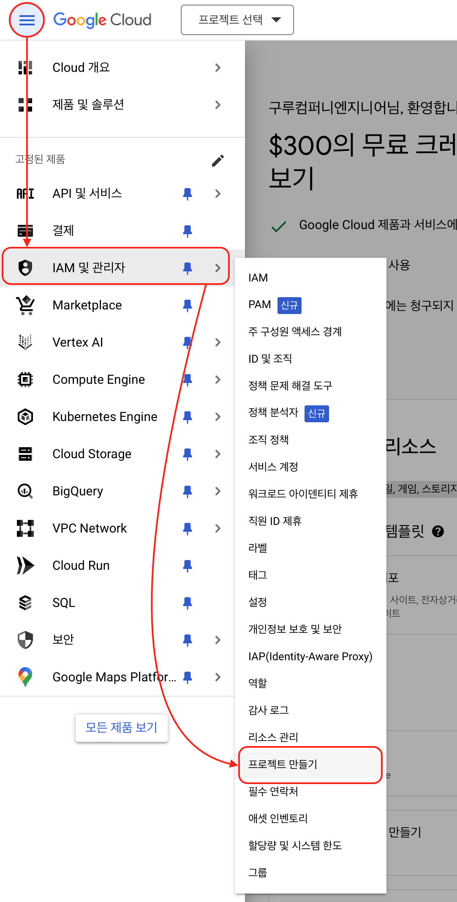<figcaption></figcaption></figure>

### 프로젝트 이름 및 기타 정보 선택

<figure>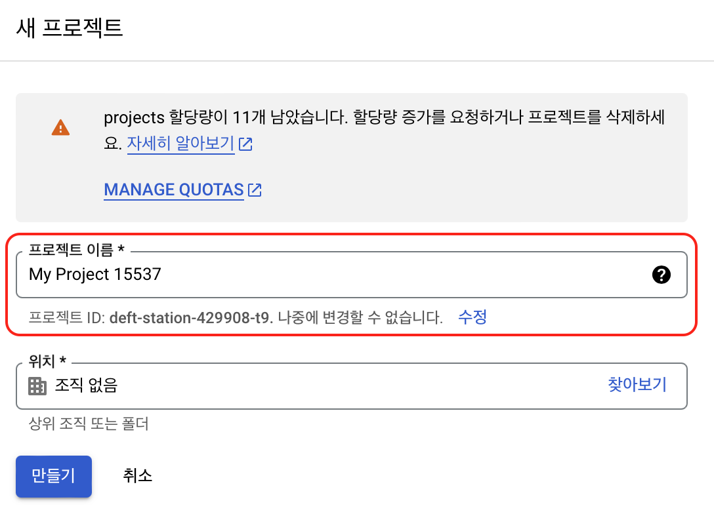<figcaption></figcaption></figure>

***

## API 사용 설정

연결된 Google Cloud 프로젝트를 설정했다면 이 프로젝트에 대한 Google Play Developer API를 사용 설정해야 합니다. 이렇게 하려면 Google Cloud 프로젝트의 소유자여야 합니다.

{% embed url="https://medium.com/@su_bak/google-play-android-developer-api-%EC%82%AC%EC%9A%A9-%EB%B0%A9%EB%B2%95-d39ca46ff9ca" %}

### 생성 또는 이미 사용중인 프로젝트를 선택

<figure>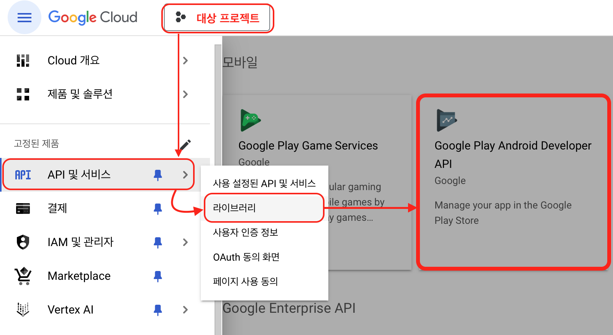<figcaption></figcaption></figure>

### API 및 서비스 > 라이브러리 > Google Play Android Developer API

<figure>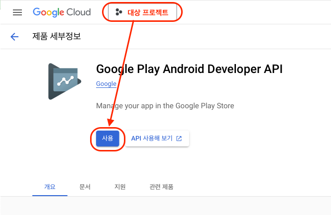<figcaption></figcaption></figure>


Google Cloud 프로젝트가 직접 업데이트되며 변경사항이 즉시 적용됩니다.


***

## 서비스 계정 생성

API를 사용하려면 연결된 Google Cloud 프로젝트에 Google Play Developer API를 사용하도록 승인된 API 키가 필요합니다.

### 서비스 계정 생성

<figure>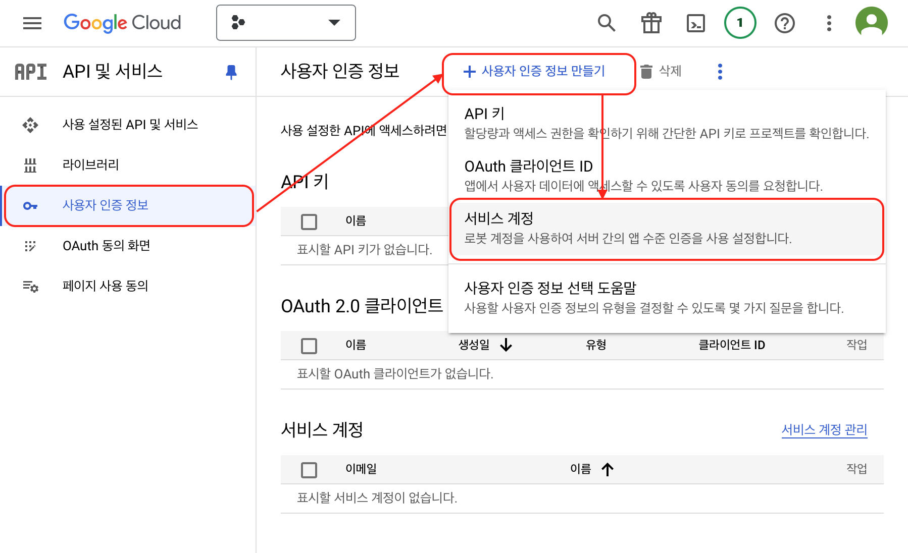<figcaption></figcaption></figure>

### 서비스 계정 세부정보 등록

<figure>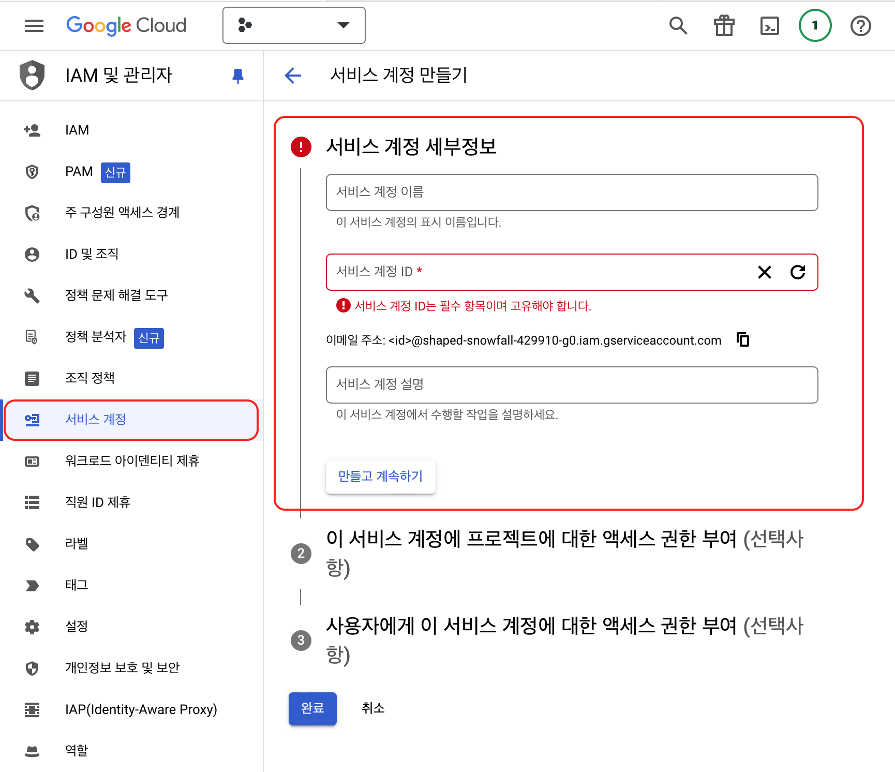<figcaption></figcaption></figure>

<figure>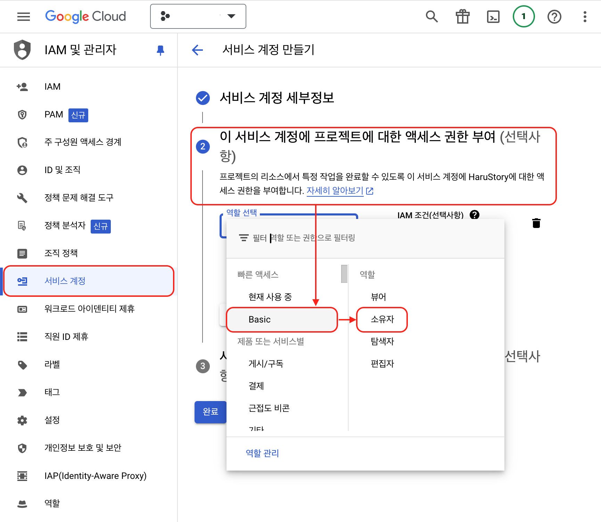<figcaption></figcaption></figure>

### 서비스 계정 키생성

<figure>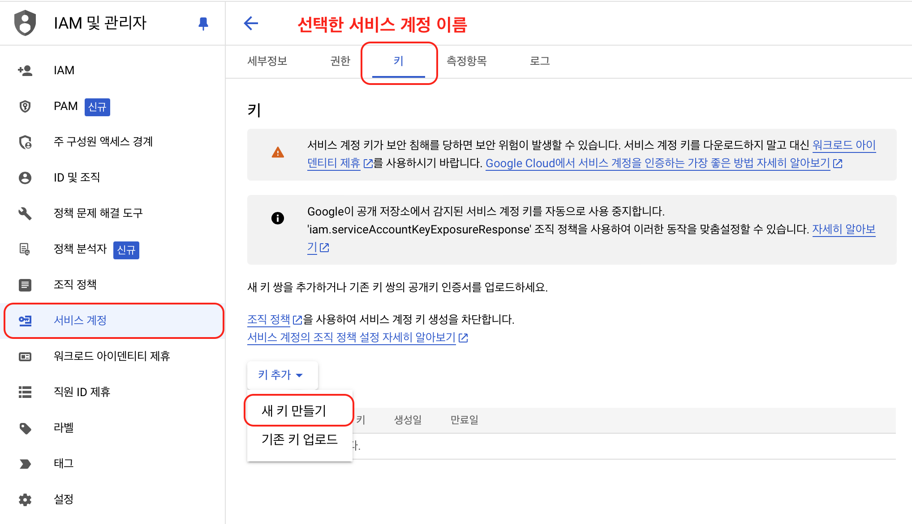<figcaption></figcaption></figure>


“JSON” 형태의 키를 생성하고 생성된 키를 다운로드 받습니다.

***

**\[주의] 다운로드한 서비스 계정의 키 파일은 다시 다운로드할 수 없습니다. 분실한다면 키를 폐기하고, 신규로 생성해야 합니다. 또한 키는 서비스 계정에 부여한 모든 권한을 사용할 수 있으므로 키 보안에 각별히 유의하십시오.**


<figure>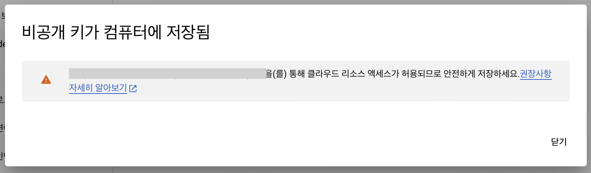<figcaption></figcaption></figure>

***

## 서비스 계정을 플레이 콘솔과 연결


생성된 Google Cloud API 계정을 구글 플레이 콘솔에서 “**재무 데이터**”에 접근 할 수 있도록 **권한을 설정**합니다.


### 구글 클라우드 서비스에서 생성한 계정의 이메일 주소 복사

<figure>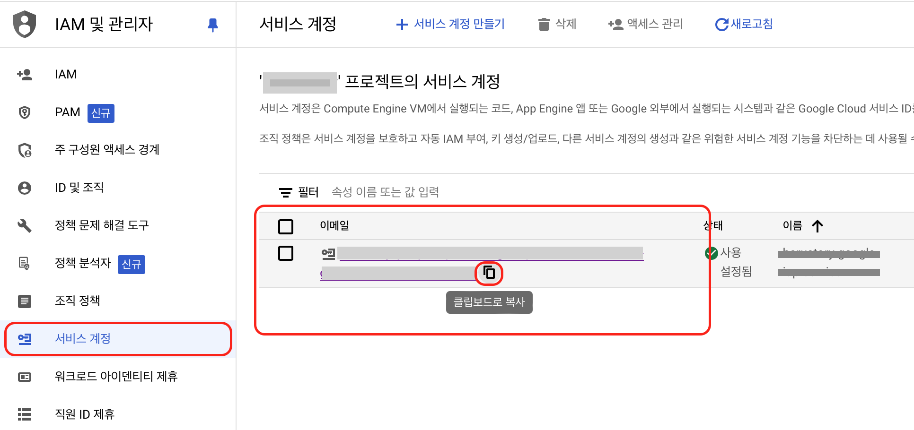<figcaption></figcaption></figure>

### 계정 추가를 위해 [Google Play Console](https://play.google.com/console/developers)에 접속합니다.

<figure>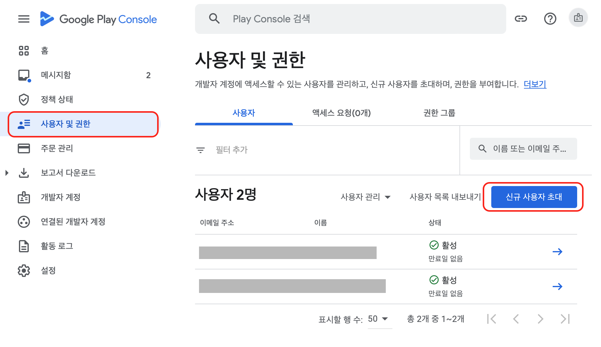<figcaption></figcaption></figure>

### 사용자 초대 및 재무 데이터 권한 설정

<figure><figcaption></figcaption></figure>

***

## 구글 클라우드 서비스 계정 키값 전달


구글 클라우드 서비스 계정에서 생성한 **JSON 키**를 **구루컴퍼니에 전달** 또는 **관리자 페이지에서 등록** 합니다.


<figure><figcaption></figcaption></figure>

