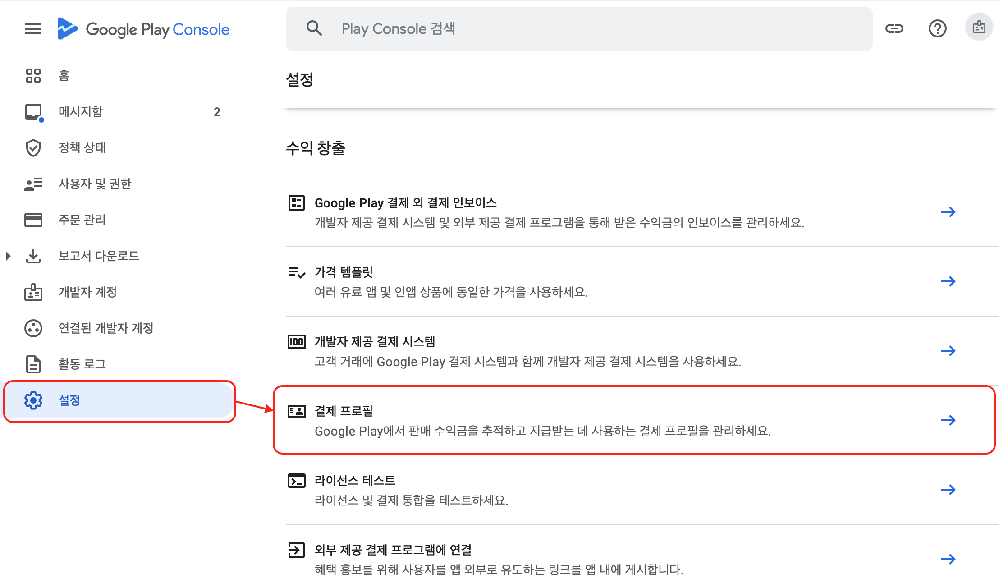
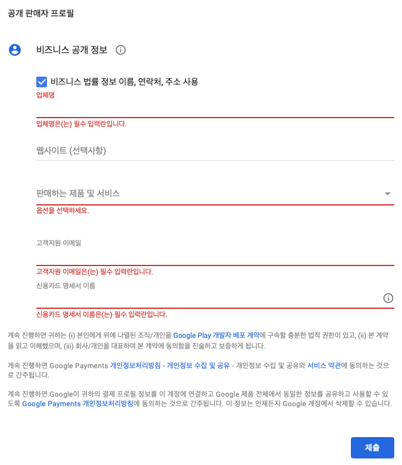
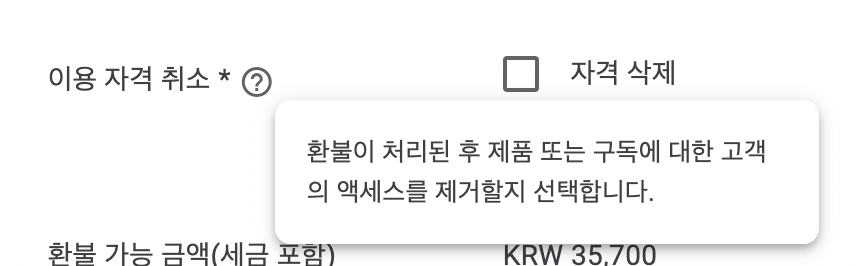

# 플레이 스토어 결제 기능 설정


**결제 기능을 활성를 위해서는 구글 플레이 콘솔의 “**<mark style="color:red;">**소유자**</mark>**” 계정이 필요합니다.**

***

:white\_check\_mark: <mark style="color:red;">**이미 결제 기능을 사용하고 있다면, 별도 활성화 작업은 필요하지 않습니다.**</mark>


***

## 참고 사이트

:link:[Google Play Console](https://play.google.com/console/developers)([https://play.google.com/console/developers](https://play.google.com/console/developers))

***

## 연동 순서

1. 구글 플레이 콘솔에 “계정 소유자”로 로그인
2. 결제 프로필 설정(생성) → 개발자 계정 연결
3. 결제 기능 설정 결제 관련 Library(com.android.billingclient) 포함된 **앱 버전을 게시**
4. 인앱 제품 생성 및 구성 구루 컴퍼니에서 구성에 필요한 제품 정보 전달

***

## Google Play 개발자 계정과 결제 프로필 연결


**결제 프로필 설정은 “**<mark style="color:red;">**소유자**</mark>**” 계정으로만 프로필 설정이 가능합니다.**


Google Play에서 유료 앱과 인앱 상품을 판매하려면 :link:[Google 결제 센터에서 프로필을 설정](https://support.google.com/paymentscenter/answer/7161426)해야 합니다.

결제 센터 프로필을 만들면 Play Console에 자동으로 연결됩니다. 프로필이 연결되면 앱 판매 관리, 판매 보고서 확인, 판매 대금 받기 등 다양한 활동을 할 수 있습니다.

### 결제 프로필 설정 메뉴

<figure><figcaption></figcaption></figure>

### 공개 판매자 프로필 설정

<figure><figcaption></figcaption></figure>

***

## Google Play Console 결제 관련 기능 설정

개발자 계정을 설정한 후에는 Google Play 결제 라이브러리가 포함된 **앱 버전을 게시**해야 합니다. 이 단계는 판매하려는 제품을 구성하는 등 Google Play Console에서 결제 관련 기능을 사용 설정하는 데 필요합니다.

> 판매 하려는 상품 등록 및 결제 관련 기능 설정을 위해서는 Payment 관련 라이브러리가 포함된 앱이 게시되어야 함 → 기존에 결제 관련 기능을 사용하고 있지 않은 앱사의 경우 연동 단계에서 테스트가 불가함 → 내부 테스트 트랙을 포함한 어떤 트랙에든 게시 하면 되는 부분이라 커뮤니케이션을 통해 진행 가능

***

## 인앱 제품 생성 및 구성(앱 게시 후 가능)

결제 관련 기능 설정 후 접근 가능

인앱 상품 관리를 위한 계정 등록 후 해당 계정으로 로그인해서 등록 하거나, 앱사에 등록에 필요한 데이터 전달 하여 앱의 상품 등록 가능

“수익 창출 → 인앱 상품” 항목에서 제품 생성 및 구성이 가능

상품 ID, 상품명, 상품설명, 아이콘, 가격 정보가 필요하며, CVS파일을 통해 여러 상품을 한번에 등록 할 수 있다.

{% embed url="https://support.google.com/googleplay/android-developer/answer/1153481?hl=ko#zippy=,%EB%8B%A8%EC%9D%BC-%EC%9D%B8%EC%95%B1-%EC%83%81%ED%92%88-%EB%A7%8C%EB%93%A4%EA%B8%B0,%EC%97%AC%EB%9F%AC-%EC%9D%B8%EC%95%B1-%EC%83%81%ED%92%88-%EC%9D%BC%EA%B4%84-%EB%A7%8C%EB%93%A4%EA%B8%B0" %}


Play Console에서 환불한 구매건이 Voided Purchase API를 통해 조회 되지 않는 경우 → 개발자가 취소 옵션을 설정하지 않고 환불하면 주문이 API 표시 되지 않습니다. → '이용 자격 취소' 체크한 환불건만 조회된다. (revoke entitlement) ([문서](https://developers.google.com/android-publisher/voided-purchases))


<figure><figcaption></figcaption></figure>
