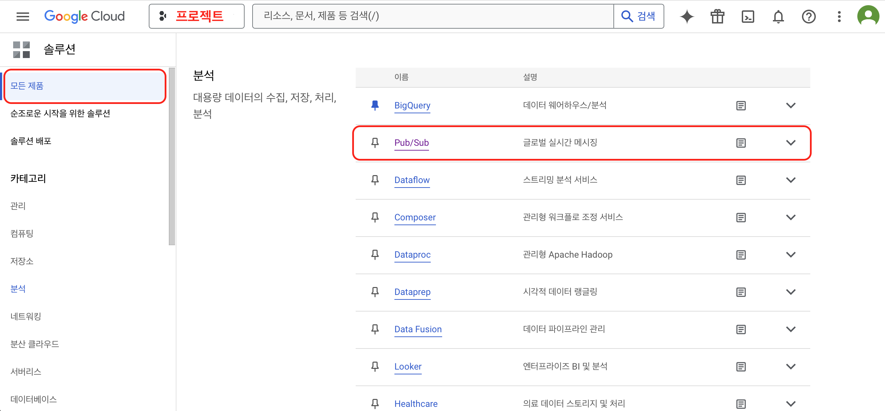
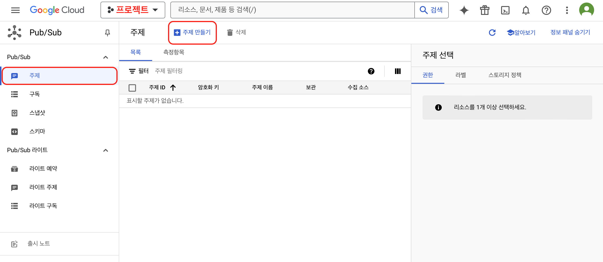
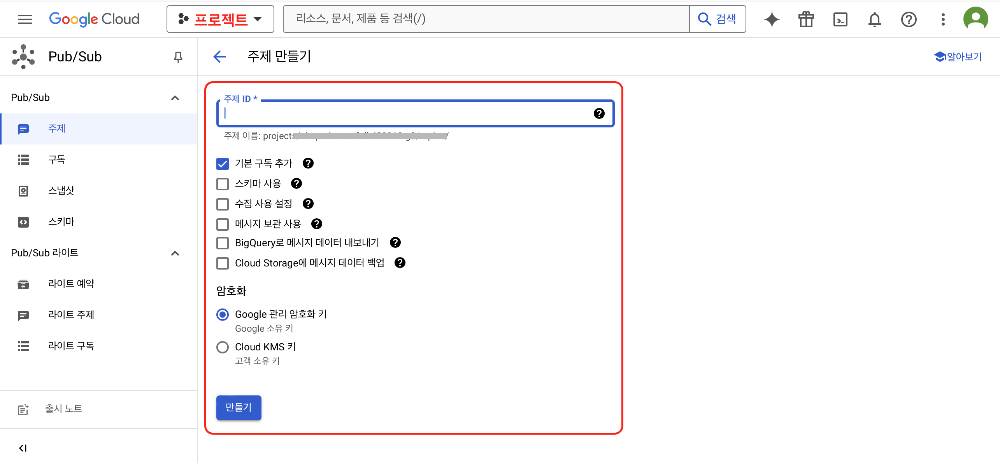
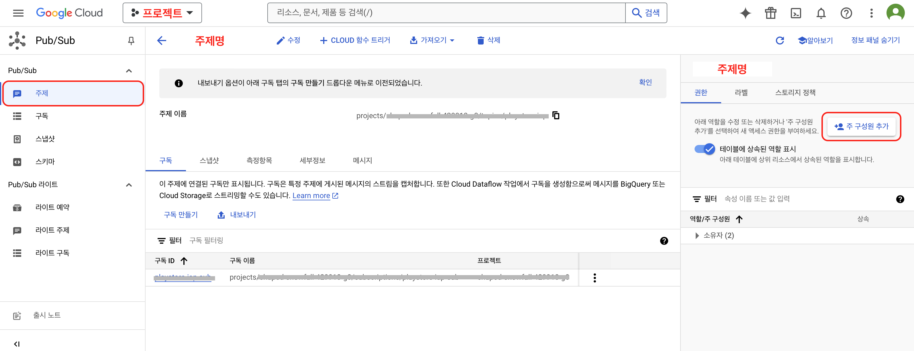
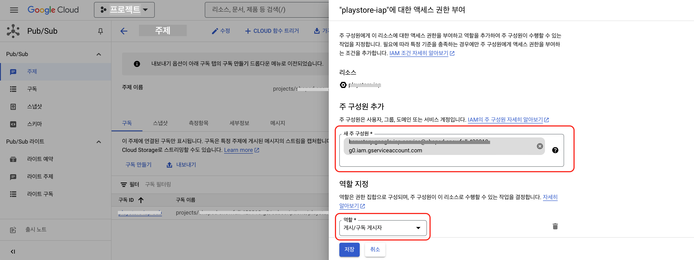
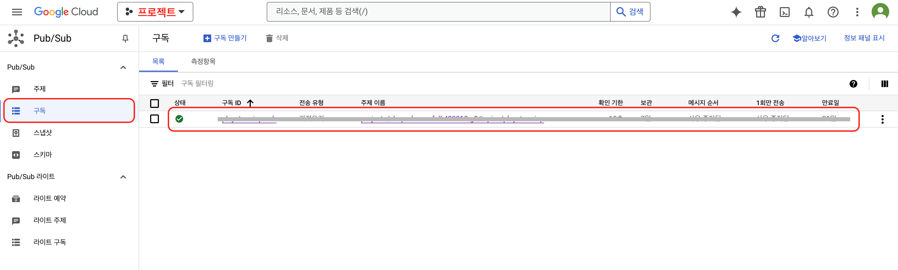
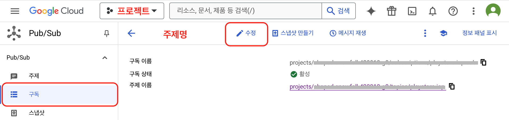
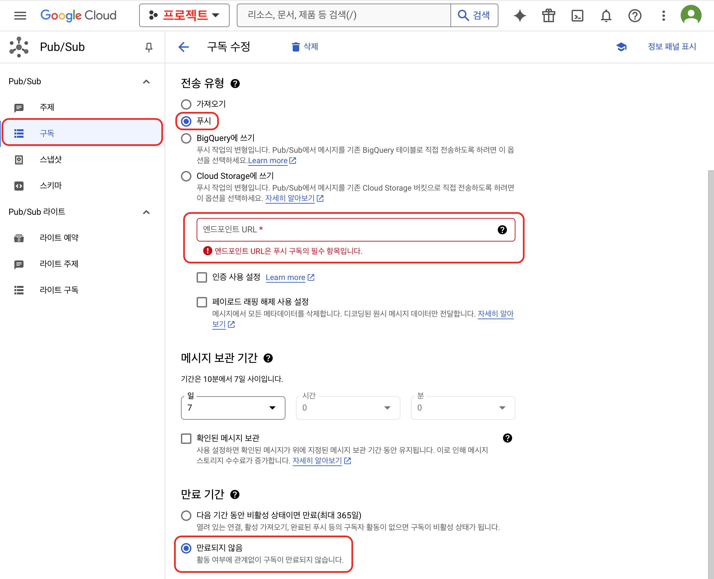
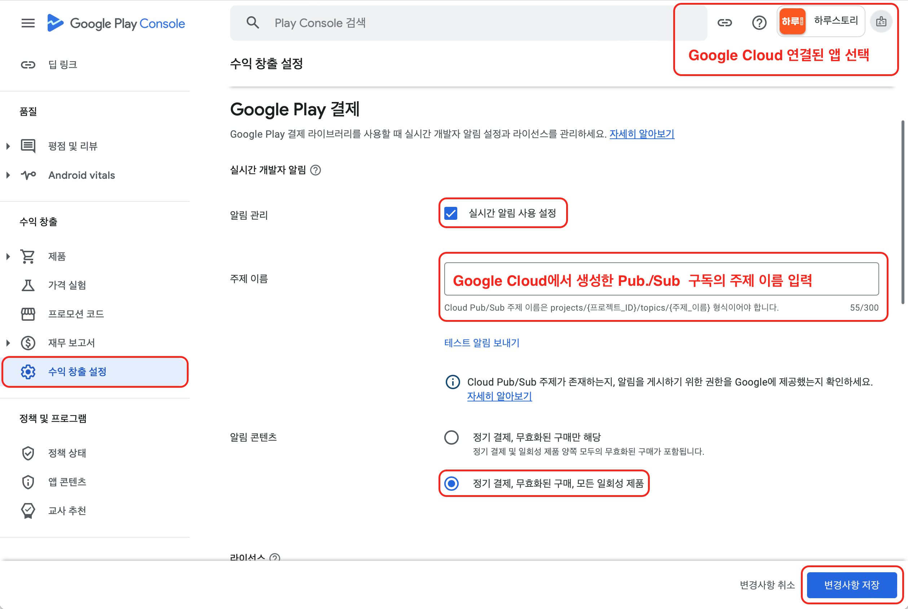

# 구글 클라우드 실시간 알림 설정

## 시작하기

Google Play에서 상품을 판매하는 경우 보물섬 IAP에서 Google로부터 알림을 받아 구매 정보에 대한 최신 상태를 관리할 수 있습니다.

**이미 구독을 사용하고 있는 경우 알림을 받을 서버를 보물섬 IAP 앤드포인트로 변경 후 보물섬 관리자를 통해 기존에 사용중인 앱사의 앤드포인트를 입력하시면 보물섬의 상품이 아닌 상품의 결제에 대한 알림을 중계합니다.**

***

## 연동 순서



### 알림 주제 생성

Google Cloud 알림 주제 생성



### 게시 구독 설정

Google Cloud 알림 주제에 게시할 구독 설정



### 구독 주제 등록

Google Play Console에 설정한 구독 주제 등록



***

## Google Cloud 알림 주제 생성

1. :link:[Google Cloud DashBoard](https://console.cloud.google.com/home/dashboard) 접속합니다.
2. **Pub/Sub 주제 만들기**를 클릭합니다.
3. **주제 ID**를 입력학고, **기본 구독 추가** 및 **Google 관리 암호화키**를 선택하여 주제를 생성합니다.
4. **Pub/Sub** 메뉴가 보이지 않을 경우 **제품 및 솔루션 > 모든 제품**에서 접근이 가능합니다.

### Pub/Sub 주제만들기 메뉴 진입

<figure><figcaption></figcaption></figure>

<figure><figcaption></figcaption></figure>

### Pub/Sub 주제 만들기

<figure><figcaption></figcaption></figure>

### Pub/Sub 주제에 대한 액세스 권한 부여

<figure><figcaption></figcaption></figure>

🔥 주제가 생성되면 구독 이벤트가 발생했을 때 주제에 게시할 게시자를 추가해야 합니다.&#x20;

**→** 생성된 주제를 선택 후 **권한** 탭에서 **주 구성원 추가**를 클릭합니다.

**새 주 구성원**은 를, **역할**은 **게시/구독 게시자**를 선택하고 저장합니다. **→ 플레이 콘솔과 연결된 서비스 계정을 선택합니다.**

<figure><figcaption></figcaption></figure>

***

## Google Cloud 알림 주제에 게시할 구독 설정

* 주제를 생성하면 **구독** 메뉴에서 해당 주제의 구독이 함께 생성된 것을 볼 수 있습니다.
* 구독 수정으로 들어가 **전송 유형**은 **푸시**를 선택하고, **엔드포인트 URL**은 **보물섬 IAP의 알림 수신 주소를** 입력합니다.&#x20;
* 이미 만들어진 주제에 구독을 추가하고 싶다면 **구독 만들기**로 구독을 추가할 수도 있습니다.


**보물섬 IAP 알림 수신 주소**

***

`https://api-iap.cloud.toast.com/callback/subscription/{YOUR_PACKAGE_NAME}/`


### 생성된 구독 확인

<figure><figcaption></figcaption></figure>

### 생선된 구독 선택 > 수정 메뉴로 이동

<figure><figcaption></figcaption></figure>

### 구독 수정&#x20;

<figure><figcaption></figcaption></figure>

**✓ 전송 유형 → 푸시**&#x20;

**✓ 앤드포인트 URL 입력 → 보물섬 IAP 알림 수신 주소**&#x20;

**✓ 만료기간 설정 → 만료되지 않음(별도 관리를 위해 만료기간을 설정해도 무방합니다.)**

***

## Google Play Console에 설정한 구독 주제 등록

* **홈** 화면에서 알림을 받을 앱을 선택 후 **수익 창출 설정**으로 들어갑니다.
* **Google Play 결제** 항목 중 **주제 이름**에 앞서 만든 주제의 이름을 입력합니다.

<figure><figcaption></figcaption></figure>

***

## 실시간 개발자 알림 참조 가이드


