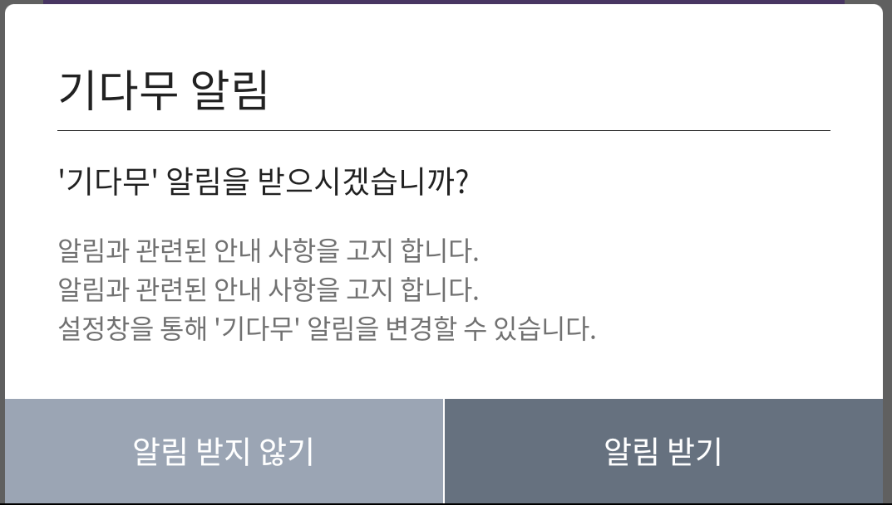

# 보물섬 알림 서비스@ANDROID

***


**보물섬의 기다무 서비스 사용시 유저에게 푸시 알림을 보내는 기능입니다.**

***

:heavy\_check\_mark: 보물섬 알림 서비스는 로컬 푸시로 별도의 서버 연동 작업이 필요하지 않습니다.

:heavy\_check\_mark: 의존성 추가 이외의 작업이 필요하지 않습니다.


<figure><figcaption><p>기다무 알림 설정 예시 화면</p></figcaption></figure>

<figure><figcaption><p>기다무 알림 예시 화면</p></figcaption></figure>

***

## 기본 모듈 적용 하기

기본 블록을 **앱(모듈) 수준의 "build.gradle"** 파일에 설정하세요.


최신 버전 사용을 권장하며, :link:[release.md](../android-sdk/release.md "mention")를 통해 최신 버전을 확인 하세요.

***

알림서비스(treasureisland-plug-notify) 버전은 **보물섬 기본 모듈의 버전과 동일합니다**.



```gradle
dependencies {
  implementation 'kr.co.studioguru.sdk:treasureisland-plug-notify:{SDK-VERSION}'
}
```


***


