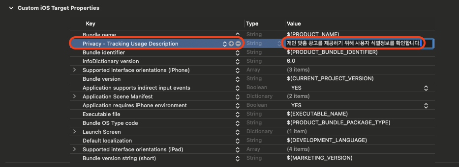
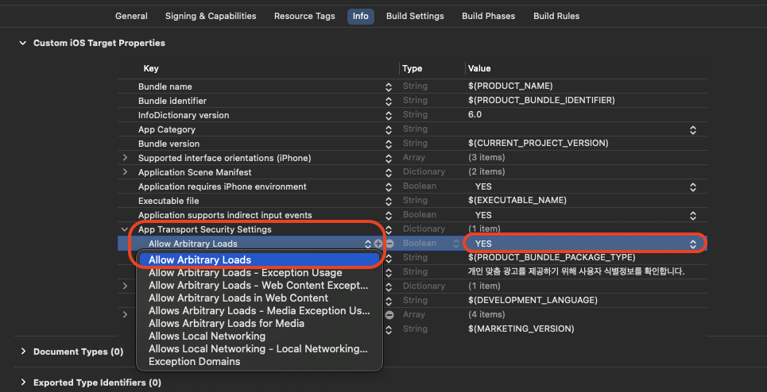

# 시작하기

## 연동 순서



### 요구 사항 확인

OS와의 호환성을 위해 최신 버전으로 업데이트하는 것을 권장합니다.



### 연동키 발급

연동에 필요한 키를 영업 담당자를 통해 요청 합니다.



### 기본 모듈 적용

Flutter Package

https://dart.cloudsmith.io/studio-guru/treasureisland-flutter/



### 플랫폼별 설정

✓ Android 원격 저장소 설정

✓ iOS Pod Install → Privacy - Tracking Usage Description & IDFA 동의 설정



***

## 요구사항


요구 사양은 보물섬 Flutter Package 최신 상태를 기준으로 명시 됩니다.

***

OS와의 호환성을 위해 최신 버전으로 업데이트하는 것을 권장합니다.


### Flutter

**✓ Flutter 3.27.1을 이용해 개발 되었습니다.**

**✓ Dart 3.6.0을 이용해 개발 되었습니다.**

### Android

✓ Android 5.0(API Level 21) 이상을 권장합니다.

✓ Android gradle plugin → 4.0.1 이상

✓ Google Play 타겟 API 수준 → Compile SDK Version 34(🔗[Google Play의 대상 API 수준 요구사항 충족](https://developer.android.com/google/play/requirements/target-sdk?hl=ko))

✓ Kotlin version 1.8.X 이상의 버전 권장 (개발 설정 1.9.0)

✓ Support AndroidX

### iOS

✓ iOS 15 이상을 권장합니다.

✓ Swift 5 이상의 버전을 권장합니다.

✓ 최신 버전의 XCode 사용 권장 (개발 기준 15.4 버전 사용)

***

### 연동키 발급 <a href="#undefined-2" id="undefined-2"></a>


보물섬 **Flutter-Package**를 연동하려면 연동하려는 앱의 고유 식별자가(AppId/AppSecret) 필요하며 영업 담당자를 통해 발급 전달 됩니다.


| AppID     | 앱 고유 식별자     |
| --------- | ------------ |
| AppSecret | 앱 고유 식별자 검증키 |

***

## 기본 모듈 적용

아래 명령어를 통해 addon 패키지를 추가합니다.


보물섬 SDK는 CloudSmith 저장소를 사용하고 있습니다.

***

https://dart.cloudsmith.io/studio-guru/treasureisland-flutter/


### CloudSmith 저장소 등록 하기

```sh
dart pub add flutter_treasureisland_addon:${version} --hosted-url https://dart.cloudsmith.io/studio-guru/treasureisland-flutter/
```

#### **pubspec.yaml 파일에 패키지 확인**

<pre class="language-json" data-line-numbers><code class="lang-json">dependencies:
  flutter:
    sdk: flutter
  ...
  ...
<strong>  flutter_treasureisland_addon:
</strong><strong>    hosted: https://dart.cloudsmith.io/studio-guru/treasureisland-flutter/
</strong><strong>    version: ${version}
</strong>  ...
  ...
</code></pre>

터미널에서 아래 명령어를 실행하여 추가한 패키지를 설치합니다.

```sh
$ flutter pub get
```

**✓ 이 명령어는 `pubspec.yaml` 파일에 정의된 패키지들을 설치하고, pubspec.lock 파일을 업데이트합니다.**

***

## Android 원격 저장소 설정

**보물섬은** 🔗[**Cloud-Smith**](https://cloudsmith.com/company/about) **서비스를 이용하여 ANDROID SDK를 제공하며, 해당 서비스의 저장소 설정이 필요합니다.**


Android Maven Repository URL

***

https://dl.cloudsmith.io/public/studio-guru/treasureisland-android/maven/



<pre class="language-gradle" data-line-numbers><code class="lang-gradle">allprojects {
    repositories {
        google()
        mavenCentral()
        maven {
<strong>            url "https://dl.cloudsmith.io/public/studio-guru/treasureisland-android/maven/"
</strong>        }
    }
}
</code></pre>

<figure><figcaption></figcaption></figure>

***

## iOS

**패키지 설치 후 "pod install" 명령어를 통해 의존성을 추가 합니다.**

```sh
$ pod install
```

### IDFA 사용동의 설정

보물섬 SDK는 개인 맞춤 광고를 제공하기 위해 사용자 식별 정보(IDFA(ADID))를 확인 합니다.

**info.plist** 또는 **TARGETS** → **Info** → **Custom iOS Target Properties** 값을 업데이트 합니다.

<table><thead><tr><th width="319">Key</th><th>Value</th></tr></thead><tbody><tr><td>Privacy - Tracking Usage Description<br>NSUserTrackingUsageDescription</td><td>개인 맞춤 광고를 제공하기 위해 사용자 식별 정보를 사용합니다.</td></tr></tbody></table>

<figure><figcaption></figcaption></figure>

<figure><figcaption></figcaption></figure>

***

### iOS ATS(App Transport Security) 정책 설정

일부 광고 제공 업체 또는 개발 모드의 경우 https를 제공하지 않는 경우로 안헤 ATS 설정이 필요합니다.

<table><thead><tr><th width="321">Key</th><th width="276">Sub Key</th><th>Value</th></tr></thead><tbody><tr><td>App Transport Security Setting</td><td>Allow Arbitrary Loads</td><td>YES</td></tr></tbody></table>

<figure><figcaption></figcaption></figure>

