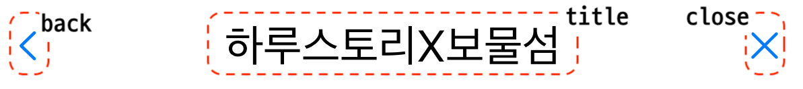
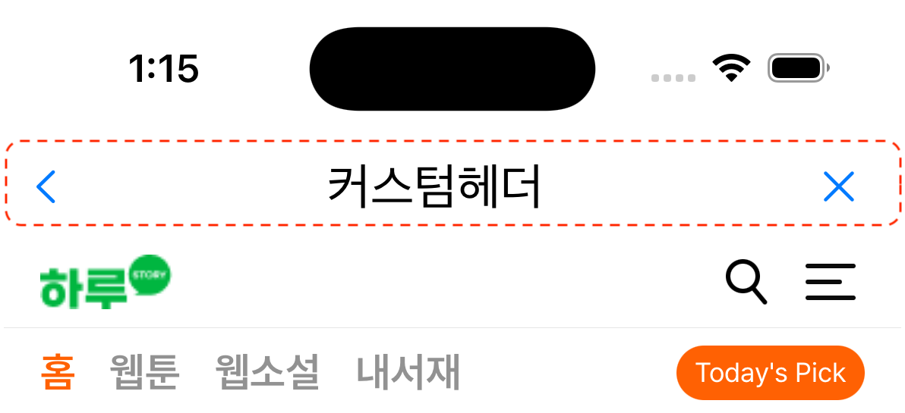

# Options

## Header Style

Launcher Builder Option -> withHeader(headerModel: SceneHeaderModel) 설정을 통해 구성

<mark style="color:red;">**✓ 설정을 하지 않을 경우 해더는 노출되지 않습니다.**</mark>

### Preset

기본 설정된 값을 사용하여 Header를 구성합니다.

| View Height | Title            | Font    | Title Color |
| ----------- | ---------------- | ------- | ----------- |
| 44          | option(nullable) | .title2 | #000000     |

<figure><figcaption><p>PRESET</p></figcaption></figure>

Back, Close, Title 노출 유무 설정이 가능 하며  "Back & Close" 는 창을 닫는 동일한 동작을 수행합니다.


```swift
let presetHeader = SceneHeaderModel.PresetBuilder()
    // Header Title(빈값 타이틀 노출 되지 않음)
    .withTitle("하루스토리X보물섬")
    // Header Use Back Button 
    .withUseBackButton(true)
    // Header Use Close Button
    .withUseCloseButton(true)
    .build()

//...
//...
// launchKit builder
launchKitBuilder.withHeader(headerModel: presetHeader)
// ..
// launchKit launch
```


***

### Custom

앱 스타일에 맞는 별도의 헤더를 구성할 수 있습니다.

✓ Header UIView 생성합니다.

✓ UIViewSceneHeader(UIView 상속) 클래스를 상속받는 UIView를 설정합니다.

✓ withHeader 함수를 통해 생성된 View를 설정합니다.

UIViewSceneHeader에는 참조 가능한 UIViewController, WKWebView 프로퍼티가 존재합니다.

| UIViewController       | WKWebView     |
| ---------------------- | ------------- |
| sceneUIViewController? | sceneWebView? |

<figure><figcaption><p>CUSTOM HEADER</p></figcaption></figure>

#### Custom Header Code Example


```swift
class CustomHeader: UIViewSceneHeader {
    override init(frame: CGRect) {
        super.init(frame: frame)
        self.addSubview(stackHeaderContainer)
        NSLayoutConstraint.activate([
            stackHeaderContainer.topAnchor.constraint(equalTo: topAnchor),
            stackHeaderContainer.trailingAnchor.constraint(equalTo: trailingAnchor),
            stackHeaderContainer.leadingAnchor.constraint(equalTo: leadingAnchor),
            stackHeaderContainer.bottomAnchor.constraint(equalTo: bottomAnchor)
        ])
    }

    required init?(coder: NSCoder) {
        fatalError("init(coder:) has not been implemented")
    }

    @objc func handleTapCloseGesture(_ gesture: UITapGestureRecognizer) {
        // UIViewSceneHeader's UIViewController
        self.sceneUIViewController?.dismiss(animated: false)
    }

    private lazy var stackHeaderContainer: UIStackView = {
        let container: UIStackView = UIStackView(frame: .zero)
        container.axis = .horizontal
        container.alignment = .center
        container.distribution = .fillProportionally
        container.backgroundColor = .white
        container.translatesAutoresizingMaskIntoConstraints = false
        // title
        let title: UILabel = UILabel(frame: .zero)
        title.text = "커스텀헤더"
        title.textAlignment = .center
        title.backgroundColor = .white
        title.font = UIFont.preferredFont(forTextStyle: .title2)
        title.textColor = UIColor.black
        title.translatesAutoresizingMaskIntoConstraints = false

        let buttonLeft = UIButton(frame: CGRect(x: 0, y: 0, width: 44, height: 44))
        buttonLeft.backgroundColor = .white
        buttonLeft.setImage(UIImage(systemName: "chevron.backward"), for: .normal)
        buttonLeft.addGestureRecognizer(UITapGestureRecognizer(target: self, action: #selector(self.handleTapCloseGesture(_:))))
        buttonLeft.translatesAutoresizingMaskIntoConstraints = false

        let buttonRight = UIButton(frame: CGRect(x: 0, y: 0, width: 44, height: 44))
        buttonRight.backgroundColor = .white
        buttonRight.setImage(UIImage(systemName: "xmark"), for: .normal)
        buttonRight.addGestureRecognizer(UITapGestureRecognizer(target: self, action: #selector(self.handleTapCloseGesture(_:))))
        buttonRight.translatesAutoresizingMaskIntoConstraints = false

        container.addArrangedSubview(buttonLeft)
        container.addArrangedSubview(title)
        container.addArrangedSubview(buttonRight)
        return container
    }()
}

```


#### Custome View 설정

```swift
let customHeader = SceneHeaderModel.CustomBuilder()
    // UIView의 인스턴스를 설정합니다.
    .withView(CustomHeader())
    .build()
    
//...
//...
// launchKit builder
launchKitBuilder.withHeader(headerModel: customHeader)
// ..
// launchKit launch
```


