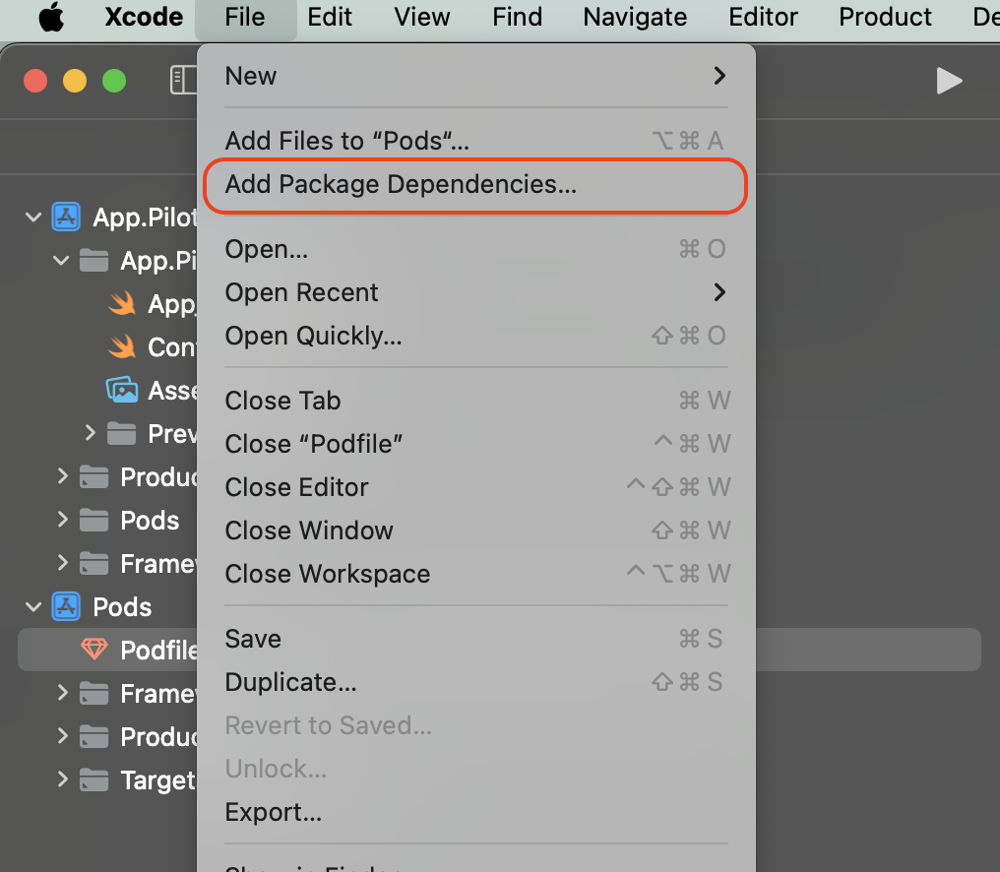

# 보물섬 인앱 구매 서비스@PLUG

***


**보물섬의 유료 재화(유료 이용권)를 인앱 구매(IAP) 기능 입니다.**

***

:heavy\_check\_mark:  모듈 적용 후 SDK 초기화에서 구매 모듈 추가 작업이 필요합니다.

:heavy\_check\_mark: 인앱 구매 기능은 스토어에 유료 결제 관련 설정 및 구글 클라우드 서비스의 계정 정보 설정이 필요합니다.

:heavy\_check\_mark: 보물섬 SDK는 StoreKit2 버전을 사용합니다.

:heavy\_check\_mark: 보물섬 SDK는 소비성 제품만 제공 됩니다.


***

## 연동 순서

1. **TreasureIslandPlugPurchaseKit** 모듈 설치하기&#x20;
2. **TreasureIslandPlugPurchaseKit** 모듈 연동하기
3. **애플 앱 스토어 설정**
   1. [console-config.md](console-config.md "mention")
   2. [api-config.md](api-config.md "mention")
   3. [rtdn-config.md](rtdn-config.md "mention")

***

## 모듈 설치 하기

###  COCOA PODS

보물섬 SDK를 설치하고자 하는 프로젝트의 Podfile에 다음 항목을 추가 합니다.


**모듈 정보**

***

:heavy\_check\_mark: pod 'TreasureIslandFoundationKit', '{SDK-VERSION}'

:heavy\_check\_mark: pod 'TreasureIslandSceneKit', '{SDK-VERSION}'

:heavy\_check\_mark: pod '**TreasureIslandPlugPurchaseKit**', '{SDK-VERSION}'



```sh
# pod respository url
source 'https://github.com/CocoaPods/Specs.git'
# target project
target '{TARGET-PROJECT}' do
  use_frameworks!
  # 보물섬 필수 SDK
  pod 'TreasureIslandFoundationKit', '{SDK-VERSION}'
  pod 'TreasureIslandSceneKit', '{SDK-VERSION}''
  # 보물섬 구매 서비스 SDK(PurchaseKit PLUG)
  pod 'TreasureIslandPlugPurchaseKit', '{SDK-VERSION}''
end
```


pod install 명령어를 통해 보물섬 SDK를 설치합니다.

```sh
$ pod install
```

###  SWIFT PACKAGE


**기본 모듈 적용**

***

:heavy\_check\_mark: [https://github.com/Studio-GURU/TreasureIsland-iOS-Plug-PurchaseKit.git](https://github.com/Studio-GURU/TreasureIsland-iOS-Plug-PurchaseKit.git)


#### Package Dependency 설정

**⬇ Xcode -> File -> Add Package Dependencies...**&#x20;

<figure><figcaption></figcaption></figure>

<figure><figcaption></figcaption></figure>

***

## 모듈 연동 하기

보물섬 초기화 부분에 다음 코드를 추가합니다.


```swift
import TreasureIslandFoundationKit
import TreasureIslandSceneKit
// import!!
import TreasureIslandPlugPurchaseKit

// SceneKit
let sceneKit = SceneKit.Builder(
    appId: "{APP-ID}", 
    appSecret: "{APP-SECRET}"
)
// option: 로그 출력 여부를 설정
.withAllowLog(allow: true)
// PlugPurchaseKit을 추가 합니다.
.withContractorPurchase(builder: PlugPurchaseKit.builder())
// TreasureKit 인스턴스 생성
.build()
// 보물섬 SDK 초기화
sceneKit.initialize()
```


***

## 애플 앱스토어 구매를 위한 스토어 설정 안내

애플 앱스토어 구매를 위해서는 아래와 같은 설정이 필요합니다.

* [console-config.md](console-config.md "mention")
* [api-config.md](api-config.md "mention")
* [rtdn-config.md](rtdn-config.md "mention")

