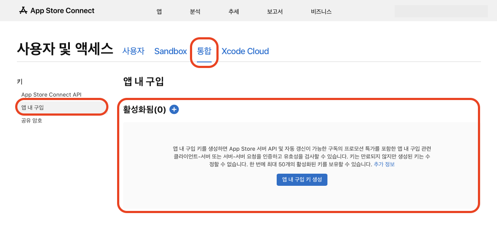
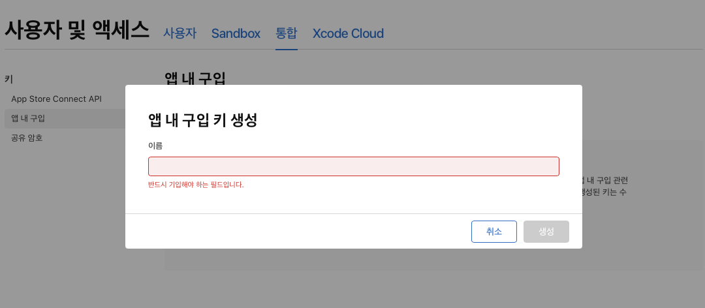
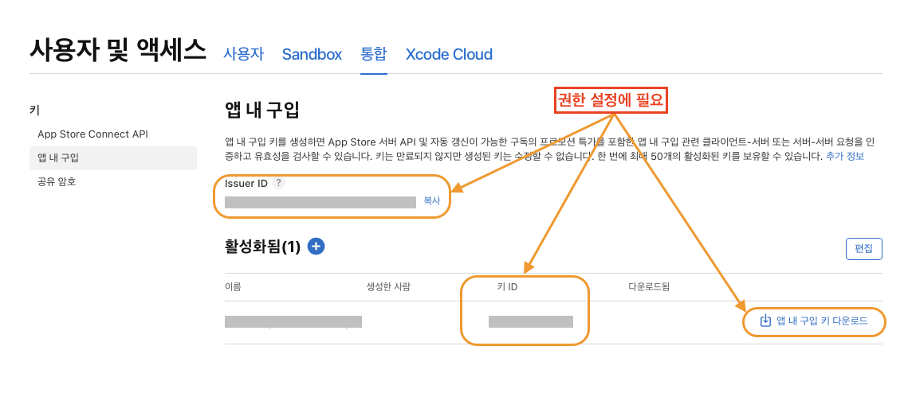

# 애플 앱스토어 API 권한 설정

## 참고 자료



***

## 시작하기


구루 컴퍼니는 **StoreKit2** 버전에 대응하여 API를 지원합니다.

***

:heavy\_check\_mark: StoreKit2 + 신버전의 영수증 검증


1. **App Store Connect → 사용자 및 액세스 → 키 또는 통합** **키 유형 → 앱 내 구입**
2. **앱 내 구입키 생성**
3. **앱 내 구입 키 다운로드**

### App Store Connect → 사용자 및 액세스 → 키 또는 통합 → 앱 내 구입

<figure><figcaption></figcaption></figure>

### 앱 내 구입키 생성 (원하는 이름으로 생성)

<figure><figcaption></figcaption></figure>

### 생성 키 확인 및 저장


#### 필수 확인 정보

***

#### :heavy\_check\_mark: **확인 정보를 구루 컴퍼니에 전달 합니다.**


| **IssueID** | **키 ID** | **앱 내 구입 키 다운로드 파일** |
| ----------- | -------- | -------------------- |

<figure><figcaption></figcaption></figure>

