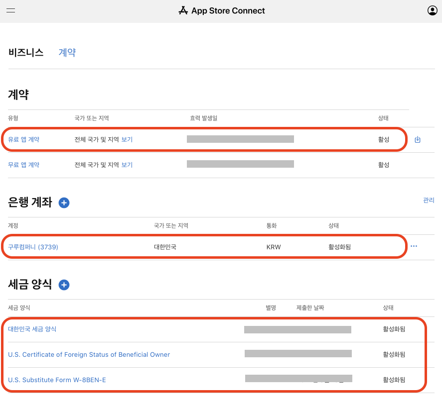

# 애플 앱스토어 권한 설정

[Apple Developer Program 사용권 계약](https://developer.apple.com/kr/terms/)을 통해 Apple Developer Program의 일부로 App Store에 무료 앱을 배포할 수 있습니다.

App Store에서 앱을 유료로 판매하거나 앱 내 구입을 제공하려면, “계정 소유자” 역할의 사용자는 반드시 “유료 앱 계약(Paid Apps Agreement)”에 서명해야 합니다.

***

## 시작하기

애플 앱스토어 인앱 결제 기능을 적용을 위해서는 “유료 앱 기능” 활성화가 필요 합니다.



***

## 유료 앱 계약

Apple Developer 소유자 권한으로 로그인하여 “비즈니스” 메뉴를 통해 “유료 앱 계약”을 확인 합니다.

“유료 앱 계약”이 없는 경우 유료 계약서 서명을 통해 계약을 진행합니다.


<mark style="color:red;">**유료 앱 계약을 위해서는 사업자 등록증, 거주지 증명서, 통신판매업 사업자 증명서, 통장 사본등의 서류가 필요하며, 국문도 가능하지만 영문으로 발급 받는것을 추천합니다.**</mark>


### 유료 앱 계약 확인

<figure><figcaption></figcaption></figure>

:heavy\_check\_mark: **새로운 유료 앱 계약을 위해서 아래의 링크의 “유료 계약서 서명” 가이드에 따라 서명을 진행합니다.**



***

## 결제 기능 활성화

유료 앱 계약이 완료 되었다면, App Store Connect에서 앱 내 구입 설정을 진행 합니다.

[앱 내 구입을 생성](https://developer.apple.com/kr/help/app-store-connect/manage-consumable-and-non-consumable-in-app-purchases/create-in-app-purchases)하고 제품 이름, 설명, 가격 및 사용 가능 여부와 같은 메타데이터를 추가합니다. 또한 [앱 내 구입 키를 생성](https://developer.apple.com/kr/help/app-store-connect/configure-in-app-purchase-settings/generate-keys-for-in-app-purchases)하고 [세금 카테고리를 설정](https://developer.apple.com/kr/help/app-store-connect/configure-in-app-purchase-settings/set-a-tax-category-for-in-app-purchases)해야 합니다. 이를 통해 Apple이 고객 거래에 적용되는 적절한 세금을 계산할 수 있습니다.
