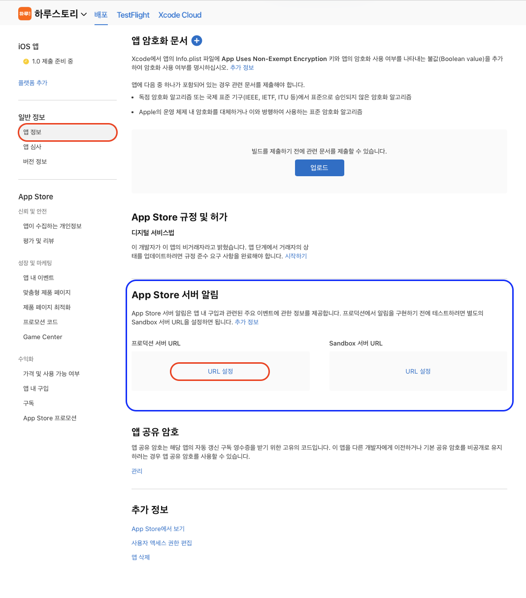
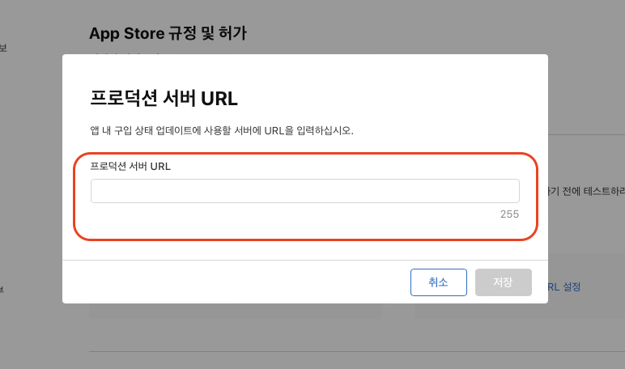
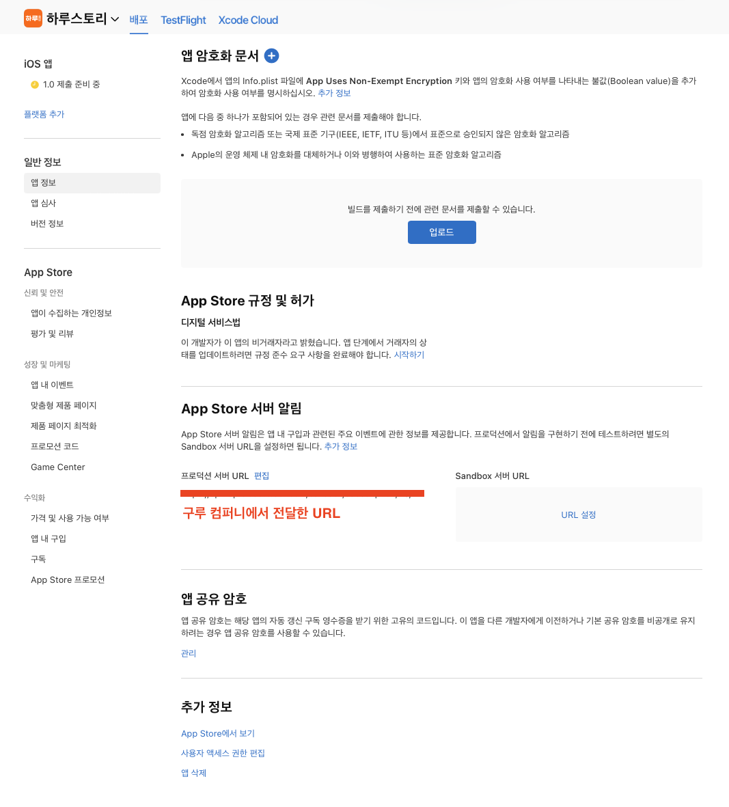

# 애플 앱스토어 실시간 알림 설정

## 참고 자료



***

## 시작하기

1. **App Store Connect → 나의 앱 → 앱 선택 → 일반 정보 → 앱 정보 → App Store 서버 알림**
2. **프로덕션 서버 URL** 또는 **Sandbox 서버 URL(테스트)** → **URL 설정** 선택
3. 알림 URL 입력

### App Store 서버 알림 접근

App Store Connect → 나의 앱 → 앱 선택 → 일반 정보 → 앱 정보 → App Store 서버 알림 → 프로덕션 서버 URL 또는 Sandbox 서버 URL(테스트) → URL 설정 선택

<figure><figcaption></figcaption></figure>

### 서버 URL 입력

<figure><figcaption></figcaption></figure>


알림 URL 정보

***

:heavy\_check\_mark:`https://api-iap.cloud.toast.com/callback/subscription/{APP_BUNDLE_ID}/AS/v2`


### 서버 URL 확인

<figure><figcaption></figcaption></figure>
