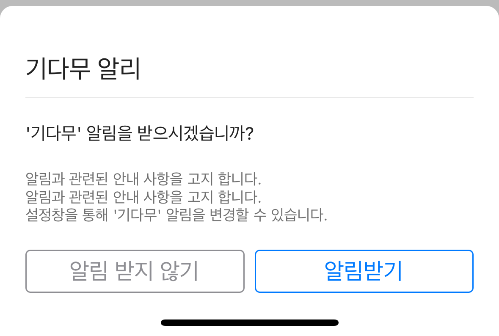
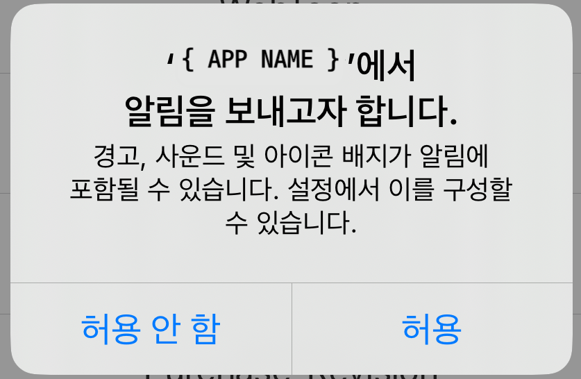
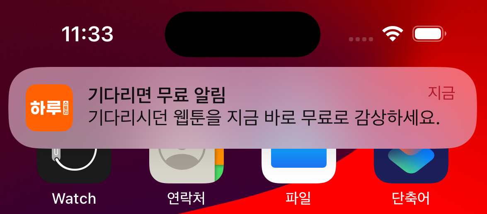

# 보물섬 알림 서비스@PLUG

***


**보물섬의 기다무 서비스 사용시 유저에게 푸시 알림을 보내는 기능입니다.**

***

보물섬 알림 서비스는 **로컬 푸시**로 별도의 서버 연동 작업이 필요하지 않습니다.


<div><figure><figcaption><p>기다무 설정 화면</p></figcaption></figure> <figure><figcaption></figcaption></figure> <figure><figcaption></figcaption></figure></div>

***

## 연동 순서

1. **TreasureIslandPlugNotificationKit** 모듈 설치하기&#x20;

***

## 모듈 설 하기

###  COCOA PODS

보물섬 SDK를 설치하고자 하는 프로젝트의 Podfile에 다음 항목을 추가 합니다.


**모듈 정보**

***

:heavy\_check\_mark: pod 'TreasureIslandFoundationKit', '{SDK-VERSION}'

:heavy\_check\_mark: pod 'TreasureIslandSceneKit', '{SDK-VERSION}'

:heavy\_check\_mark: pod '**TreasureIslandPlugNotificationKit**', '{SDK-VERSION}'



```sh
# pod respository url
source 'https://github.com/CocoaPods/Specs.git'
# target project
target '{TARGET-PROJECT}' do
  use_frameworks!
  # 보물섬 필수 SDK
  pod 'TreasureIslandFoundationKit', '{SDK-VERSION}'
  pod 'TreasureIslandSceneKit', '{SDK-VERSION}''
  # 보물섬 알림 서비스 SDK(Notififatioin PLUG)
  pod 'TreasureIslandPlugNotificationKit', '{SDK-VERSION}''
end
```


pod install 명령어를 통해 보물섬 SDK를 설치합니다.

```sh
$ pod install
```

###  SWIFT PACKAGE


**기본 모듈 적용**

***

:heavy\_check\_mark: [https://github.com/Studio-GURU/TreasureIsland-iOS-Plug-NotificationKit.git](https://github.com/Studio-GURU/TreasureIsland-iOS-Plug-NotificationKit.git)


#### Package Dependency 설정

**⬇ Xcode -> File -> Add Package Dependencies...**&#x20;

<figure><figcaption></figcaption></figure>

<figure><figcaption></figcaption></figure>

***


