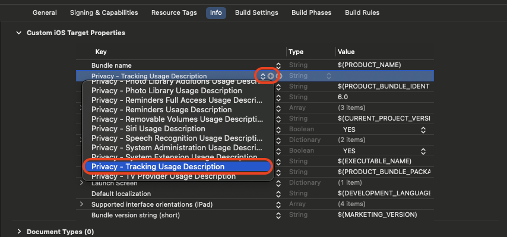

# 시작하기

***

## 연동 순서



### 요구 사항 확인

OS와의 호환성을 위해 최신 버전으로 업데이트하는 것을 권장합니다



### 연동키 발급

연동에 필요한 키를 영업 담당자를 통해 요청 합니다.



### 기본 모듈 적용

✓ CocoaPods

✓ Swift Package



### IDFA 동의 설정

보물섬 SDK는 개인 맞춤 광고를 제공하기 위해 사용자 식별 정보(IDFA(ADID))를 확인 합니다.



### iOS ATS  정책 설정

일부 광고 제공 업체 또는 개발 모드의 경우 https를 제공하지 않는 경우로 안헤 ATS 설정이 필요합니다.



***

## 요구사항


**요구 사양은 보물섬 iOS SDK의 최신 상태를 기준으로 명시됩니다.**

***

OS와의 호환성을 위해 최신 버전으로 업데이트하는 것을 권장합니다.


✓ iOS 15 이상을 권장합니다.

✓ Swift 5 이상의 버전을 권장합니다.

✓ 최신 버전의 XCode 사용 권장 (개발 기준 15.4 버전 사용)

***

## 연동키 발급


보물섬 **iOS SDK**를 연동하려면 연동하려는 앱의 고유 식별자가(AppId/AppSecret) 필요하며 영업  담당자를 통해 발급 전달 됩니다.


| AppID     | 앱 고유 식별자     |
| --------- | ------------ |
| AppSecret | 앱 고유 식별자 검증키 |

***

## 기본 모듈 적용

보물섬 SDK는 CocoaPods, SwiftPackage를 통한 설치 방법을 지원하고 있습니다.

기존 모듈은 TreasureIslandFoundationKit, TreasureIslandSceneKit 두개이며, 확장 기능(PLUG) 사용에 따라 추가 모듈이 필요할 수 있습니다.

###  COCOA PODS

<details>

<summary>COCOA PODS 안내</summary>

[https://guides.cocoapods.org/using/using-cocoapods.html](https://guides.cocoapods.org/using/using-cocoapods.html)

***

Getting Start(Installation)

[https://guides.cocoapods.org/using/getting-started.html#toc\_3](https://guides.cocoapods.org/using/getting-started.html#toc_3)

***

**CocoaPods 설치 및 Podfile 생성**

CocoaPods가 설치되어 있지 않다면 터미널에서 CocoaPods를 설치합니다.

```sh
$ sudo gem install cocoapods
```

Podfile 생성 -> Xcode 프로젝트 파일이 있는 폴더로 이용하여 Podfile을 생성합니다.

```sh
$ cd {프로젝트 파일 path}
$ pod init
```

</details>

#### 모둘 추가

보물섬 SDK를 설치하고자 하는 프로젝트의 Podfile에 다음 항목을 추가 합니다.


**기본 모듈 정보**

***

✓ pod '**TreasureIslandXFoundationKit**', '{SDK-VERSION}'

✓ pod '**TreasureIslandXSceneKit**', '{SDK-VERSION}'



```sh
# pod respository url
source 'https://github.com/CocoaPods/Specs.git'
# target project
target '{TARGET-PROJECT}' do
  use_frameworks!
  # TreasureIsland SDK
  pod 'TreasureIslandXFoundationKit', '{SDK-VERSION}'
  pod 'TreasureIslandXSceneKit', '{SDK-VERSION}'
end
```


pod install 명령어를 통해 보물섬 SDK를 설치합니다.

```sh
$ pod install
```

#### 모듈 설치 확인

workspace를 통해 프로젝트를 열고 보물섬 SDK 모듈이 정상 설치 되었는지 확인 합니다.

<div align="left"><figure><figcaption></figcaption></figure></div>

###  SWIFT PACKAGE

<details>

<summary>SWIFT PACKAGE 안내</summary>

[https://www.swift.org/documentation/package-manager/](https://www.swift.org/documentation/package-manager/)

</details>


**기본 모듈 적용**

***

<mark style="color:green;">✓</mark> [https://github.com/Studio-GURU/TreasureIslandX-iOS-FoundationKit.git](https://github.com/Studio-GURU/TreasureIsland-iOS-FoundationKit.git)

<mark style="color:green;">✓</mark> [https://github.com/Studio-GURU/TreasureIslandX-iOS-SceneKit.git](https://github.com/Studio-GURU/TreasureIsland-iOS-ServiceKit.git)


#### Package Dependency 설정

**⬇ Xcode -> File -> Add Package Dependencies...**&#x20;

<figure><figcaption></figcaption></figure>

#### Package 추가(**TreasureIsland-iOS-FounedationKit)**

✓ [https://github.com/Studio-GURU/TreasureIslandX-iOS-FoundationKit.git](https://github.com/Studio-GURU/TreasureIsland-iOS-FoundationKit.git)

**⬇ 오른쪽 상단에 SwiftPackage 주소를 입력합니다.**

<figure><figcaption></figcaption></figure>

#### Package 추가(**TreasureIsland-iOS-SceneKit)**

✓ [https://github.com/Studio-GURU/TreasureIslandX-iOS-SceneKit.git](https://github.com/Studio-GURU/TreasureIsland-iOS-ServiceKit.git)

<figure><figcaption></figcaption></figure>

#### 모듈 설치 확인

✓ Package Dependencies 항목에 추가한 모듈이 있는지 확인 합니다.

<div align="left"><figure><figcaption></figcaption></figure></div>

***

## IDFA 사용동의 설정

보물섬 SDK는 개인 맞춤 광고를 제공하기 위해 사용자 식별 정보(IDFA(ADID))를 확인 합니다.

**info.plist** 또는 **TARGETS → Info → Custom iOS Target Properties** 값을 업데이트 합니다.

<table><thead><tr><th width="319">Key</th><th>Value</th></tr></thead><tbody><tr><td>Privacy - Tracking Usage Description<br>NSUserTrackingUsageDescription</td><td>개인 맞춤 광고를 제공하기 위해 사용자 식별 정보를 사용합니다.</td></tr></tbody></table>

<figure><figcaption></figcaption></figure>

<figure><figcaption></figcaption></figure>

***

## iOS ATS(App Transport Security) 정책 설정

일부 광고 제공 업체 또는 개발 모드의 경우 https를 제공하지 않는 경우로 안헤 ATS 설정이 필요합니다.

<table><thead><tr><th width="321">Key</th><th width="276">Sub Key</th><th>Value</th></tr></thead><tbody><tr><td>App Transport Security Setting</td><td>Allow Arbitrary Loads</td><td>YES</td></tr></tbody></table>

<figure><figcaption></figcaption></figure>


