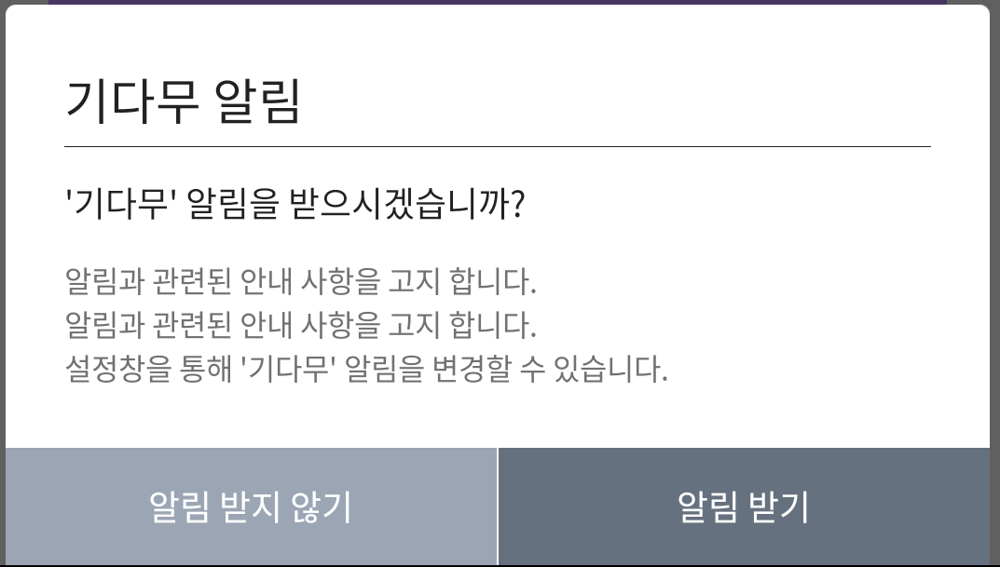
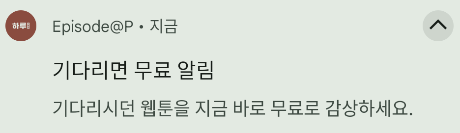
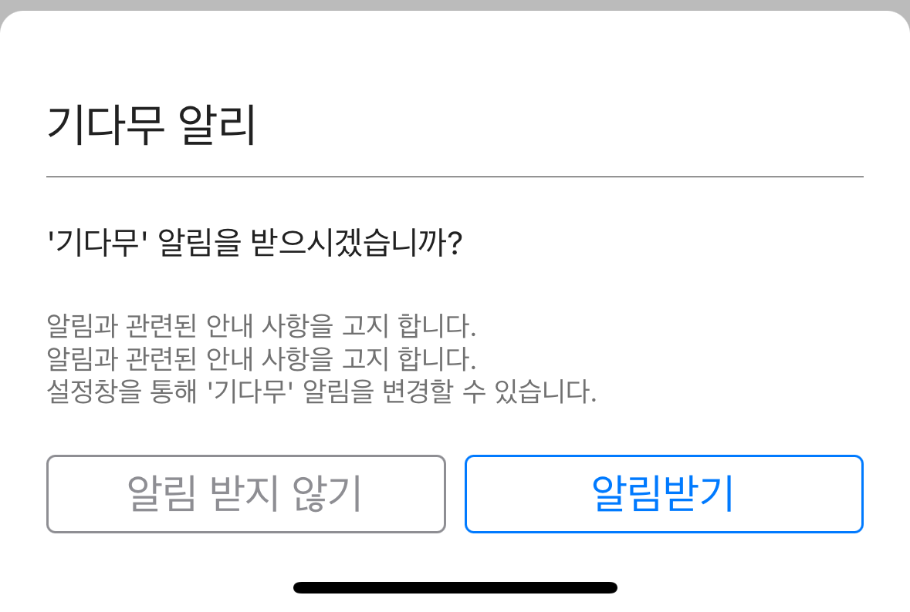
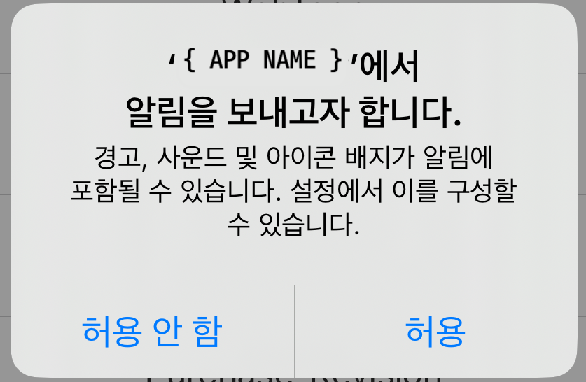
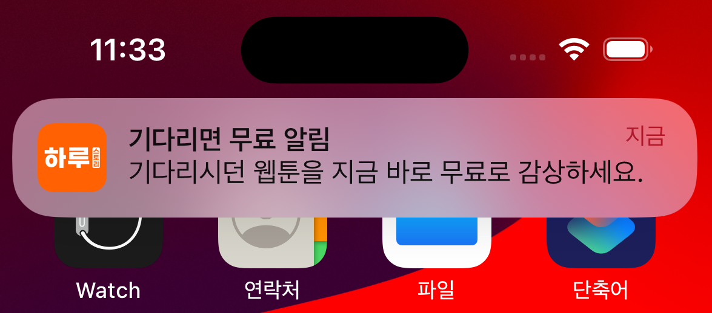
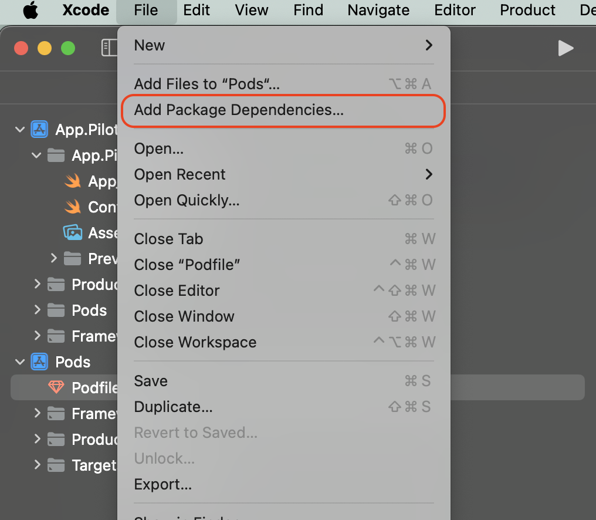

# 보물섬 알림 서비스


**보물섬의 기다무 서비스 사용시 유저에게 푸시 알림을 보내는 기능입니다.**

***

✓보물섬 알림 서비스는 **로컬 푸시**로 별도의 서버 연동 작업이 필요하지 않습니다.

✓ 의존성 추가 이외의 작업이 필요하지 않습니다.




<figure><figcaption><p>기다무 알림 설정 예시 화면</p></figcaption></figure>

<figure><figcaption><p>기다무 알림 예시 화면</p></figcaption></figure>

***

## 기본 모듈 적용 하기

기본 블록을 **앱(모듈) 수준의 "build.gradle"** 파일에 설정하세요.


최신 버전 사용을 권장하며, :link:[release.md](../android-sdk/release.md "mention")를 통해 최신 버전을 확인 하세요.

***

알림서비스(tresurecomics-plug-notify) 버전은 **보물섬 기본 모듈의 버전과 동일합니다**.



```gradle
dependencies {
    implementation 'com.treasurecomics.sdk:plug-notify:{SDK-VERSION}'
}
```


***



<div><figure><figcaption><p>기다무 설정 화면</p></figcaption></figure> <figure><figcaption></figcaption></figure> <figure><figcaption></figcaption></figure></div>

***

## 연동 순서

1. **TreasureIslandComicsNotifyKit** 모듈 설치하기&#x20;

**✓ 모듈 적용 후 SDK 관련 추가 작업은 필요하지 않습니다.**

***

## 모듈 설 하기

###  COCOA PODS

보물섬 SDK를 설치하고자 하는 프로젝트의 Podfile에 다음 항목을 추가 합니다.


**모듈 정보**

***

**✓** pod '**TreasureComicsPlugNotifyKit**', '{SDK-VERSION}'



```sh
# pod respository url
source 'https://github.com/CocoaPods/Specs.git'
# target project
target '{TARGET-PROJECT}' do
  use_frameworks!
  # 보물섬 알림 서비스 SDK(Notififatioin PLUG)
  pod 'TreasureComicsPlugNotifyKit', '{SDK-VERSION}'
end
```


pod install 명령어를 통해 보물섬 SDK를 설치합니다.

```sh
$ pod install
```

###  SWIFT PACKAGE


**기본 모듈 적용**

***

✓ [**https://github.com/Studio-GURU/TreasureComics-iOS-Plug-NotifyKit.git**](https://github.com/Studio-GURU/TreasureComics-iOS-Plug-NotifyKit.git)


#### Package Dependency 설정

**⬇ Xcode -> File -> Add Package Dependencies...**&#x20;

<figure><figcaption></figcaption></figure>

***





