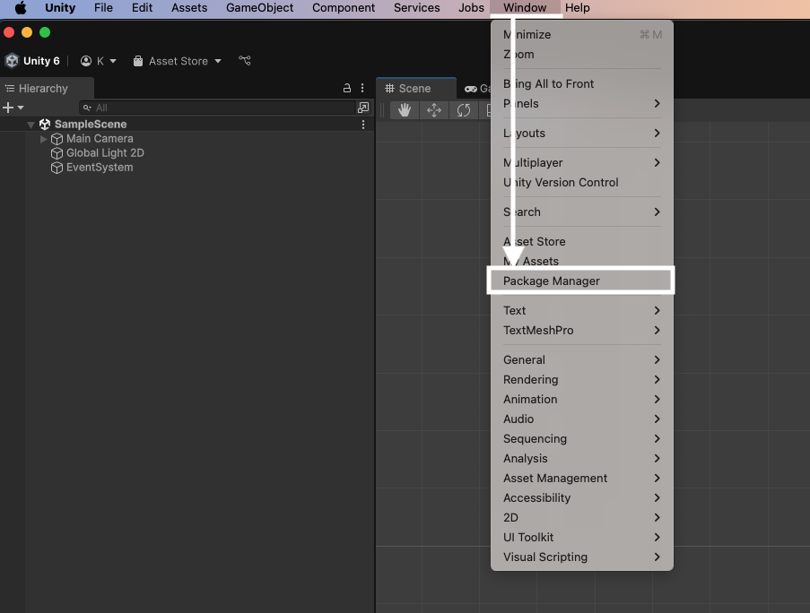
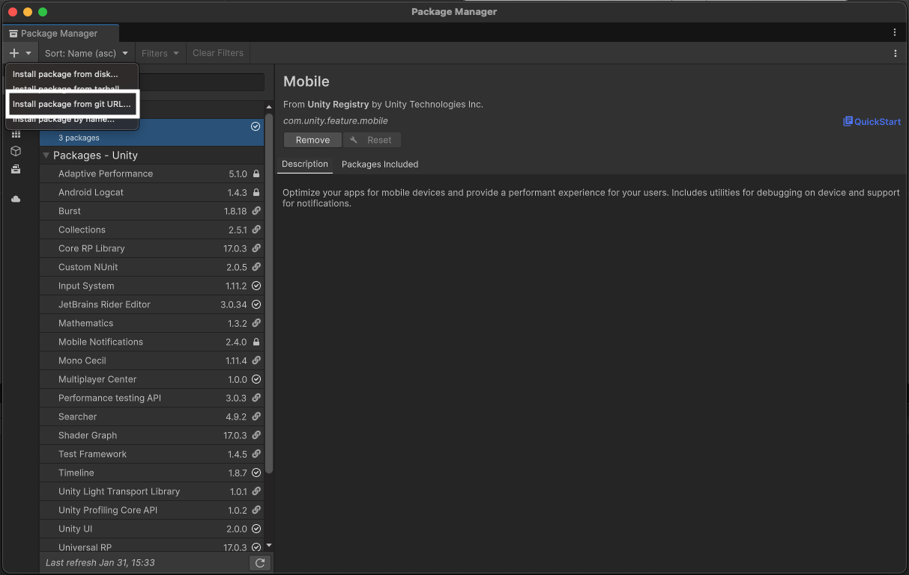
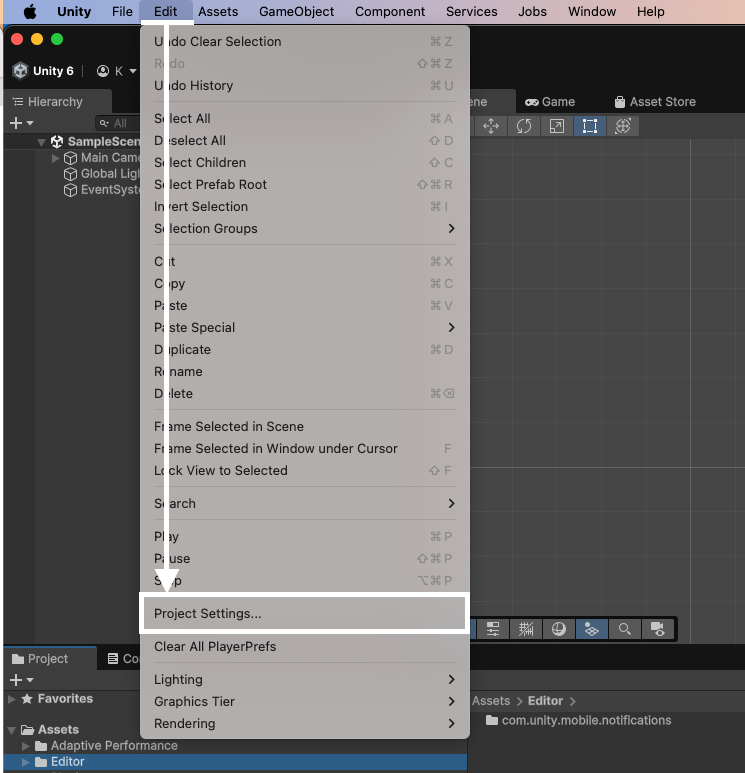
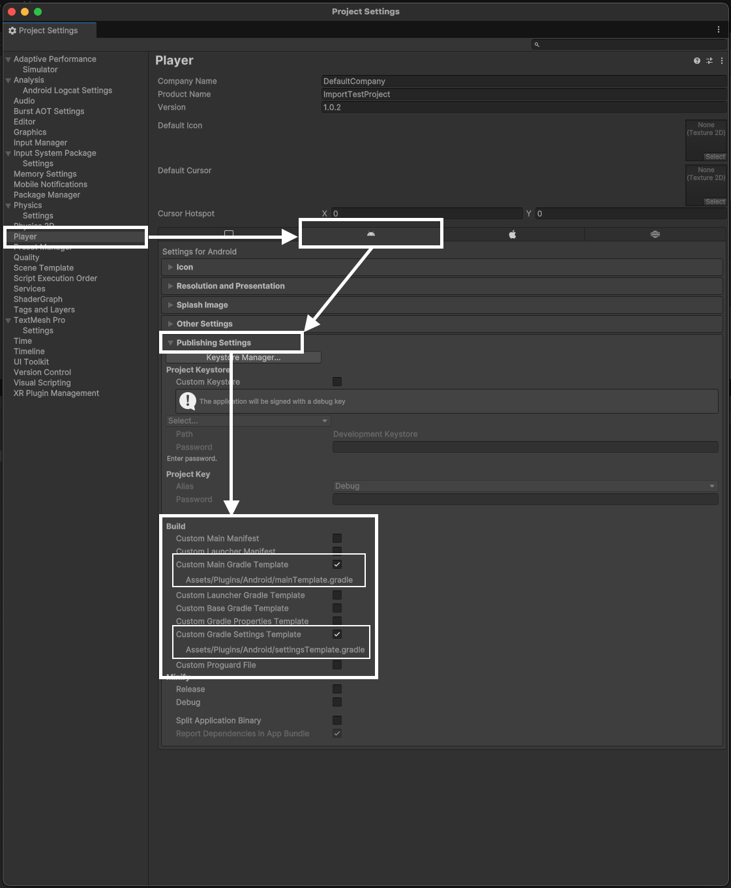
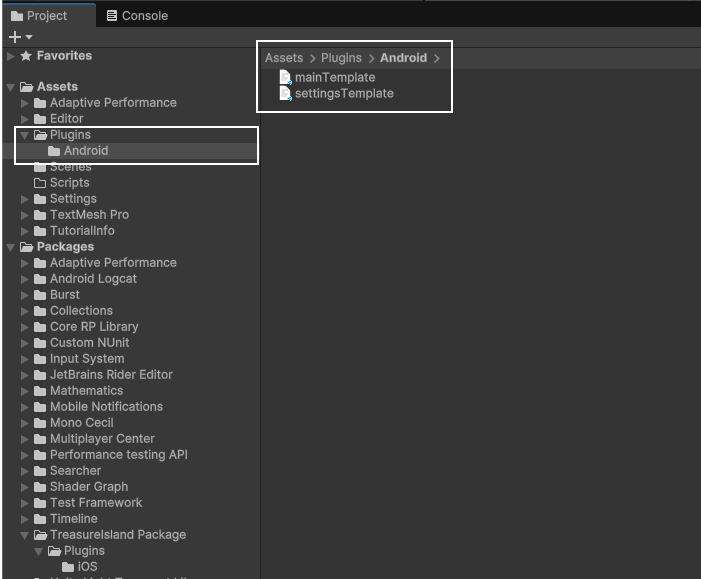
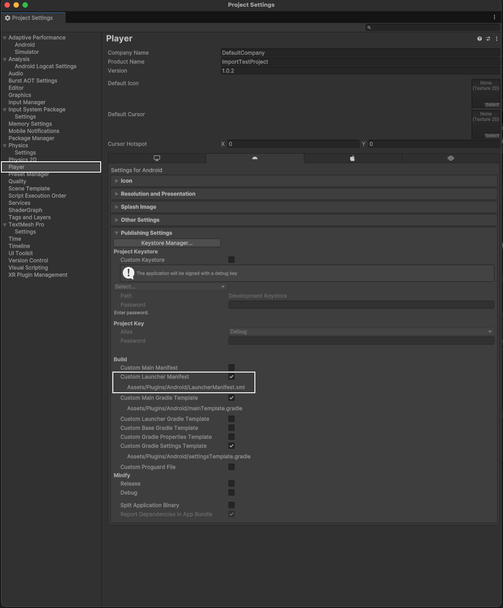

# 시작하기

## 연동 순서



### 요구 사항 확인

OS와의 호환성을 위해 최신 버전으로 업데이트하는 것을 권장합니다.



### 연동키 발급

연동에 필요한 키를 영업 담당자를 통해 요청 합니다.



### 기본 모듈 적용

Unity Package Manager



### 프로젝트 설정

android gradle & setting



### 기타 설정

android manifest 오류시 설정 처리



***

## 요구사항


요구 사양은 보물섬 Unity Package 최신 상태를 기준으로 명시 됩니다.

***

OS와의 호환성을 위해 최신 버전으로 업데이트하는 것을 권장합니다.


### Unity

**✓ Unity 6를 이용해 개발 되었습니다.**

### Android

✓ Android 5.0(API Level 21) 이상을 권장합니다.

✓ Android gradle plugin → 4.0.1 이상

✓ Google Play 타겟 API 수준 → Compile SDK Version 34(🔗[Google Play의 대상 API 수준 요구사항 충족](https://developer.android.com/google/play/requirements/target-sdk?hl=ko))

✓ Kotlin version 1.8.X 이상의 버전 권장 (개발 설정 1.9.0)

✓ Support AndroidX

### iOS

✓ iOS 15 이상을 권장합니다.

✓ Swift 5 이상의 버전을 권장합니다.

✓ 최신 버전의 XCode 사용 권장 (개발 기준 15.4 버전 사용)

***

### 연동키 발급 <a href="#undefined-2" id="undefined-2"></a>


보물섬 **Unity-Package**를 연동하려면 연동하려는 앱의 고유 식별자가(AppId/AppSecret) 필요하며 영업 담당자를 통해 발급 전달 됩니다.


| AppID     | 앱 고유 식별자     |
| --------- | ------------ |
| AppSecret | 앱 고유 식별자 검증키 |

***

## 기본 모듈 적용

### Unity Package Manager (Git)

```
https://github.com/Studio-GURU/TreasureComics-Unity-Package.git
```

Window → Unity Package Manager를 실행합니다.

<div align="left"><figure><figcaption></figcaption></figure></div>

Unity Package Manager → **install package from git URL**

<div align="left"><figure><figcaption></figcaption></figure></div>

GitHub URL을 입력합니다.

```
https://github.com/Studio-GURU/TreasureComics-Unity-Package
```

***

## 프로젝트 설정(Android)

안드로이드 의존성 추가 작업을 진행합니다.

### Project Settings

<div align="left"><figure><figcaption></figcaption></figure></div>

### Android Publishing Settings

**✓ Build** → **Custom Main Gradle Template Check**

**✓ Build** → **Custom Gradle Settings Template Check**

<div align="left"><figure><figcaption></figcaption></figure></div>

### Template File 수정

생성된 파일을 확인 합니다.

<div align="left"><figure><figcaption></figcaption></figure></div>

#### mainTemplate

Android 관련 의존성을 추가 합니다.

<pre><code><strong>implementation "com.treasurecomics.sdk:bridge-unity:$android-sdk-version"
</strong></code></pre>

<pre class="language-gradle" data-line-numbers><code class="lang-gradle">apply plugin: 'com.android.library'
apply from: '../shared/keepUnitySymbols.gradle'
...
...
dependencies {
    implementation fileTree(dir: 'libs', include: ['*.jar'])
<strong>    // 의존성을 추가 합니다.
</strong><strong>    implementation "com.treasurecomics.sdk:bridge-unity:$version"
</strong>}
...
...
</code></pre>

#### settingTemplate

Android 관련 의존성 Repository URL을 설정 합니다.

<pre><code><strong>https://dl.cloudsmith.io/public/studio-guru/treasurecomics-android/maven/
</strong></code></pre>

<pre class="language-gradle" data-line-numbers><code class="lang-gradle">...
...
dependencyResolutionManagement {
    repositoriesMode.set(RepositoriesMode.PREFER_SETTINGS)
    repositories {
        **ARTIFACTORYREPOSITORY**
        google()
        mavenCentral()
<strong>        // 의존성 관련 Repository URL 설정
</strong><strong>        maven { url = uri("https://dl.cloudsmith.io/public/studio-guru/treasurecomics-android/maven/") }
</strong>        flatDir {
            dirs "${project(':unityLibrary').projectDir}/libs"
        }
    }
}
...
...
</code></pre>

***

## Android Manifest Error

### enableOnBackInvokeCallback 오류


Manifest merger failed : Attribute application@enableOnBackInvokedCallback value=(false) from \[:unityLibrary] AndroidManifest.xml:25:9-52 is also present at \[kr.co.studioguru.sdk:treasureisland-scene:25.1.21.21] AndroidManifest.xml:15:9-51 value=(true). Suggestion: add 'tools:replace="android:enableOnBackInvokedCallback"' to element at AndroidManifest.xml:3:3-83 to override.


Project Settings > Android Publishing Settings

**✓ Build** → **Custom Launcher Manifest Check**

<figure><figcaption></figcaption></figure>

생성된 파일에 아래의 내용을 참고하여 수정 합니다.

<pre class="language-xml" data-line-numbers><code class="lang-xml">&#x3C;?xml version="1.0" encoding="utf-8"?>
&#x3C;manifest
    xmlns:android="http://schemas.android.com/apk/res/android"
    xmlns:tools="http://schemas.android.com/tools"
    android:installLocation="preferExternal">
    &#x3C;supports-screens
        android:smallScreens="true"
        android:normalScreens="true"
        android:largeScreens="true"
        android:xlargeScreens="true"
        android:anyDensity="true"/>

    &#x3C;application 
<strong>        tools:replace="android:enableOnBackInvokedCallback"
</strong><strong>        android:enableOnBackInvokedCallback="false"
</strong>        android:label="@string/app_name"
        android:icon="@mipmap/app_icon"/>
&#x3C;/manifest>

</code></pre>


