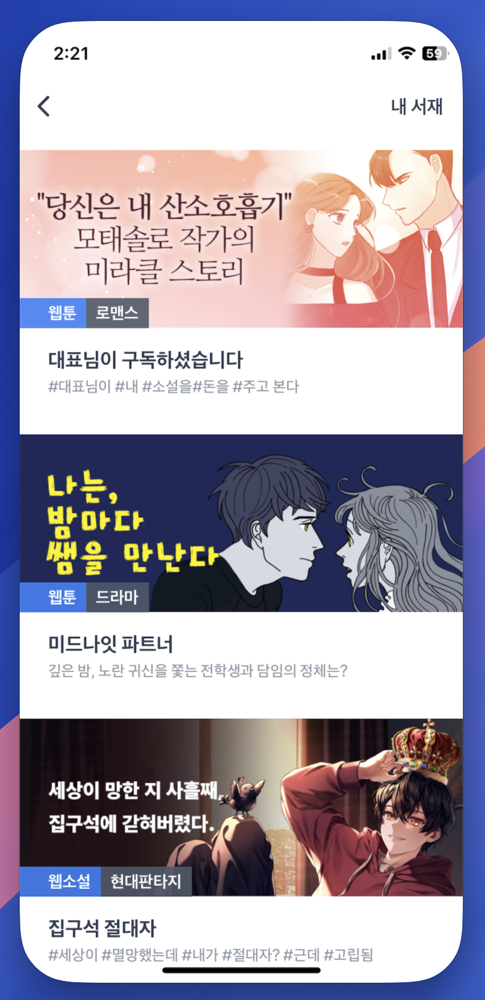

# \[ API ] 추천 컨텐츠 목록 조회

## Version

버전 정보는 URL 경로에 표현하지 않으며, 헤더의 accept-version 속성 값에 정의합니다.

| Version | Date       | Description |
| ------- | ---------- | ----------- |
| 1.0.0   | 2024.08.23 | Create      |

## Rcommendation Contents

```
테스트
GET https://api-test.treasurecomics.com/external/recommendation?sign={value}

라이브
GET https://api.treasurecomics.com/external/recommendation?sign={value}
```

&#x20;**✓ 추천 컨텐츠 목록을 반환 합니다.**

### Security


**IPSec 또는 방화벽 구성을 위한 IP 정보가 필요한 경우 아래의 내용을 참고 하세요.**


<table><thead><tr><th width="344">Url</th><th>IPAddress</th></tr></thead><tbody><tr><td><strong>api-test.treasurecomics.com</strong></td><td>43.201.240.226</td></tr><tr><td></td><td>43.202.82.8</td></tr><tr><td><strong>api.treasurecomics.com</strong></td><td>15.165.122.39</td></tr><tr><td></td><td>3.38.54.136</td></tr></tbody></table>

### Heders

| Name           | Value              |
| -------------- | ------------------ |
| Content-Type   | `application/json` |
| Authorization  | `Basic token`      |
| Accept-Version | `1.0.0`            |

### **Request Params**

<table data-full-width="false"><thead><tr><th width="116">Name</th><th width="141">Type</th><th width="127">Required</th><th>Description</th></tr></thead><tbody><tr><td>sign</td><td>string</td><td>true</td><td><a data-mention href="../../../web-view/sign.md">sign.md</a></td></tr><tr><td>adid</td><td>string</td><td>false</td><td><p>광고 식별 ID </p><p>AOS : ADID값 전달<br>IOS : IDFA값 전달</p></td></tr><tr><td>isAdult</td><td>number</td><td>false</td><td><p>성인여부</p><p>0 : 성인 X</p><p>1 : 성인</p></td></tr></tbody></table>

```
// get usage example
https://api-{env}.treasurecomics.com/external/recommendation?sign=1724328195.3da08653e6c1420aac89eecdf5c20063.OGMzYjUzYTUyYjE1YTJiNDAyZGM3MGJiZmMzMDI2YWE1NDg0YWY2ZTdjNjMyZTJlMTdjMjQyOGU1NjZhYjdhYQ
```

### **Response**

<table><thead><tr><th width="239">Fields</th><th width="106">Type</th><th>Description</th></tr></thead><tbody><tr><td><code>recommendationSN</code></td><td>number</td><td>sequence</td></tr><tr><td><code>title</code></td><td>string</td><td>제목</td></tr><tr><td><code>description</code></td><td>string</td><td>내용</td></tr><tr><td><code>thumbnail</code></td><td>string</td><td><p>썸네일 이미지 경로 ( 세로 )</p><p>1080 * 1620</p></td></tr><tr><td><code>subThumbnail</code></td><td>string</td><td>썸네일 이미지 경로 ( 가로 )<br>* 내부 정책 변경으로 지원하지 않아 사용 불가합니다.</td></tr><tr><td><code>contentType</code></td><td>string</td><td>웹툰 | 웹소설 | 숏드라마</td></tr><tr><td><code>contentCName</code></td><td>string</td><td>작품 키</td></tr><tr><td><code>episodeNo</code></td><td>number</td><td>회차 번호</td></tr><tr><td><code>genre</code></td><td>string</td><td><p>장르</p><pre><code>로맨스 · 로맨스판타지 · 판타지 · 무협 · 드라마 · 액션 · 학원 · 일상 · 스포츠 · 공포/스릴러 · BL · GL · 현대판타지 · 대체역사 · 성인
</code></pre></td></tr><tr><td><code>link</code></td><td>string</td><td><p>제공되는 링크 뒤에 sign 붙여서 전달</p><p>예)<code>&#x26;sign=1724328195.3da08653e6c1420aac89eecdf5c20063.OGMzYjUzYTUyYjE1YTJiNDAyZGM3MGJiZmMzMDI2YWE1NDg0YWY2ZTdjNjMyZTJlMTdjMjQyOGU1NjZhYjdhYQ</code></p></td></tr><tr><td><code>returnUrl</code></td><td>string</td><td>최종 이동 링크 ( 참고용 )</td></tr><tr><td><code>order</code></td><td>number</td><td>노출 우선 순위 ( 같은 값이 존재할 수 있습니다 )</td></tr><tr><td><code>recommendationDate</code></td><td>string</td><td>추천일 ( YYYY-MM-DD )</td></tr><tr><td><code>freeEpisode</code></td><td>number</td><td>무료 회차 수</td></tr><tr><td><code>isRewardAvailable</code></td><td>boolean</td><td>포인트 지급 가능 여부</td></tr><tr><td><code>minReward</code></td><td>number</td><td>지급 가능 최소 금액 ( 지급 불가능일 경우 0으로 반환 )</td></tr><tr><td><code>maxReward</code></td><td>number</td><td>지급 가능 최대 금액 ( 지급 불가능일 경우 0으로 반환 )</td></tr></tbody></table>

**Response Code**




```json
[
  {
    "recommendationSN": 3905,
    "title": "아빠 하나, 아들 하나",
    "description": "6년 전 그날, 내게 온 두 개의 선물",
    "thumbnail": "https://s.treasurecomics.com/images/prod/webtoon/cw72eeae0c62/posterThumbnail_1741841610.jpg",
    "subThumbnail": "https://s.treasurecomics.com/images/prod/dailyRecommendationContent/955aae4743c64e939ee5a2eee0911dd3.jpg",
    "contentType": "웹툰",
    "contentCName": "cw72eeae0c62",
    "episodeNo": 1,
    "genre": "로맨스",
    "link": "https://treasurecomics.com/gateway/common?returnUrl=https%3A%2F%2Ftreasurecomics.com%2Frecommendation%2Fwebtoon%2Fviewer%2Fcw72eeae0c62%2F1%3Freferrer%3Dtrecommendation%26rSN%3D3905",
    "returnUrl": "https://treasurecomics.com/recommendation/webtoon/viewer/cw72eeae0c62/1?referrer=trecommendation&rSN=3905",
    "contentMainUrl": "https://treasurecomics.com/gateway/common?returnUrl=https%3A%2F%2Fbitbunny.treasurecomics.com%2Fcontent%2Flist%2Fcw72eeae0c62",
    "order": 1,
    "freeEpisode": 5,
    "recommendationDate": "2025-04-21",
    "isRewardAvailable": false,
    "maxReward": 0,
    "minReward": 0
  },
  {
    "recommendationSN": 3906,
    "title": "당씨고아",
    "description": "복수를 가슴에 품고, 어떻게든 살아남기 위해 수단과 방법을 가리지 않는 당상원의 일대기.",
    "thumbnail": "https://s.treasurecomics.com/images/prod/novel/cn2b641081a4/posterThumbnail_1740011920.jpg",
    "subThumbnail": "https://s.treasurecomics.com/images/prod/dailyRecommendationContent/07a864bb758e44ff9e256ce8cff00173.jpg",
    "contentType": "웹소설",
    "contentCName": "cn2b641081a4",
    "episodeNo": 1,
    "genre": "무협",
    "link": "https://treasurecomics.com/gateway/common?returnUrl=https%3A%2F%2Ftreasurecomics.com%2Frecommendation%2Fnovel%2Fviewer%2Fcn2b641081a4%2F1%3Freferrer%3Dtrecommendation%26rSN%3D3906",
    "returnUrl": "https://treasurecomics.com/recommendation/novel/viewer/cn2b641081a4/1?referrer=trecommendation&rSN=3906",
    "contentMainUrl": "https://treasurecomics.com/gateway/common?returnUrl=https%3A%2F%2Fbitbunny.treasurecomics.com%2Fcontent%2Flist%2Fcn2b641081a4",
    "order": 2,
    "freeEpisode": 25,
    "recommendationDate": "2025-04-21",
    "isRewardAvailable": false,
    "maxReward": 0,
    "minReward": 0
  },
  {
    "recommendationSN": 3907,
    "title": "검도능천",
    "description": "천재 검사의 화려한 귀환",
    "thumbnail": "https://s.treasurecomics.com/images/prod/webtoon/cw05cd431719/posterThumbnail_1742364703.jpg",
    "subThumbnail": "https://s.treasurecomics.com/images/prod/dailyRecommendationContent/846ce34e46a0400dbd7ddd99c8ab2499.jpg",
    "contentType": "웹툰",
    "contentCName": "cw05cd431719",
    "episodeNo": 1,
    "genre": "무협",
    "link": "https://treasurecomics.com/gateway/common?returnUrl=https%3A%2F%2F.treasurecomics.com%2Frecommendation%2Fwebtoon%2Fviewer%2Fcw05cd431719%2F1%3Freferrer%3Dtrecommendation%26rSN%3D3907",
    "returnUrl": "https://treasurecomics.com/recommendation/webtoon/viewer/cw05cd431719/1?referrer=trecommendation&rSN=3907",
    "contentMainUrl": "https://treasurecomics.com/gateway/common?returnUrl=https%3A%2F%2Fbitbunny.treasurecomics.com%2Fcontent%2Flist%2Fcw05cd431719",
    "order": 3,
    "freeEpisode": 4,
    "recommendationDate": "2025-04-21",
    "isRewardAvailable": false,
    "maxReward": 0,
    "minReward": 0
  }
]
```





```json
{
  "code": "err_already_used_signature",
  "message": "이미 사용된 Signature 입니다.",
  "data": null,
  "appendix": {
    "reason": "이미 사용된 Signature 입니다.",
    "stack": "Error: UNHANDLED\n    at _validateSignature (/var/app/current/build/controllers/external/toss/recentView/get.1.0.0.js:33:15)\n    at process.processTicksAndRejections (node:internal/process/task_queues:95:5)"
  }
}
```




#### Reponse Error Code

<table><thead><tr><th width="307">Code</th><th>Reason</th><th>Message</th></tr></thead><tbody><tr><td><mark style="color:red;"><code>err_invalid_signature</code></mark></td><td>Signature 검증 실패</td><td>잘못된 Signature 입니다.</td></tr><tr><td><mark style="color:red;"><code>err_already_used_signature</code></mark></td><td>사용된 Signature 재사용<br>-> 5분간 제한</td><td>이미 사용된 Signature 입니다.</td></tr></tbody></table>

***

## 이미지 캐싱


**앱 성능 향상**, **네트워크 절약**, **사용자 경험 개선을 위해 "thumbnail", "subThumbnail" 항목에 대해 이미지 캐싱 처리를 권장하고 있습니다.**

***

### <mark style="color:red;">보물섬은 이미지 변경시 이미지 URL이 변경됩니다. URL을 기준으로 캐싱 정책을 구성 하기기 바랍니다.</mark>


### ✅ 1. **빠른 이미지 로딩 (퍼포먼스 향상)**

이미지를 네트워크에서 매번 불러오면 로딩 시간이 길어지고 UI가 느려질 수 있습니다.\
→ 캐시에 저장해두면 디스크나 메모리에서 **즉시 로딩** 가능

***

### ✅ 2. **네트워크 트래픽 절약**

같은 이미지를 여러 번 다운로드하면 사용자 데이터 요금이 낭비되고, 서버 비용도 증가합니다.\
→ 캐싱은 **중복 다운로드 방지**에 효과적입니다.

***

### ✅ 3. **오프라인 지원**

인터넷이 없는 환경에서도 이미 본 이미지는 캐시에서 로드 가능\
→ 뉴스 앱, 쇼핑 앱, 갤러리 앱 등에 매우 유용

***

### ✅ 4. **배터리 사용 최적화**

불필요한 네트워크 요청은 CPU와 무선 칩을 많이 사용하게 되어 배터리 소모가 큽니다.\
→ 캐시는 **배터리 절약**에도 도움이 됩니다.

***

### ✅ 5. **UX(사용자 경험) 개선**

* 이미지가 **깜빡이지 않고** 부드럽게 뜹니다.
* 리스트 스크롤 시 **끊김 없이 로딩**됩니다.
* 사용자가 **앱이 빠르다고 느끼는** 중요한 포인트입니다.

### ✅ 6. 캐싱 처리 예시

* Android
  * [Glide](https://bumptech.github.io/glide/doc/caching.html)
  * [Coil](https://coil-kt.github.io/coil/image_loaders/#caching)
  * [Picasso](https://square.github.io/picasso/) (Automatic memory and disk caching.)
* iOS
  * [KingFisher](https://swiftpackageindex.com/onevcat/kingfisher/master/documentation/kingfisher/commontasks_cache)
  * [SDWebImages](https://github.com/SDWebImage/SDWebImageSwiftUI?tab=readme-ov-file#customization-and-configuration-setup)


## 추천 컨텐츠 목록 구현 화면 예시

<div align="left"><figure><figcaption></figcaption></figure></div>


