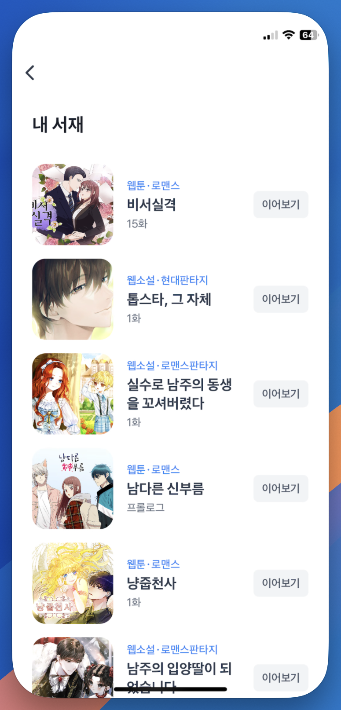

# \[API] 최근 본 작품 조회

## Version

버전 정보는 URL 경로에 표현하지 않으며, 헤더의 accept-version 속성 값에 정의합니다.

| Version | Date       | Description |
| ------- | ---------- | ----------- |
| 1.0.0   | 2024.08.23 | Create      |

## Recent View Contents

```
테스트
GET https://api-test.treasurecomics.com/external/recentView?sign={value}

라이브
GET https://api.treasurecomics.com/external/recentView?sign={value}
```

**유저의 최근 감상 컨텐츠 목록을 반환 합니다.**

### Security


**IPSec 또는 방화벽 구성을 위한 IP 정보가 필요한 경우 아래의 내용을 참고 하세요.**


<table><thead><tr><th width="344">Url</th><th>IPAddress</th></tr></thead><tbody><tr><td><strong>api-test.treasurecomics.com</strong></td><td>43.201.240.226</td></tr><tr><td></td><td>43.202.82.8</td></tr><tr><td><strong>api.treasurecomics.com</strong></td><td>15.165.122.39</td></tr><tr><td></td><td>3.38.54.136</td></tr></tbody></table>

### Heders

| Name           | Value              |
| -------------- | ------------------ |
| Content-Type   | `application/json` |
| Authorization  | `Basic token`      |
| Accept-Version | `1.0.0`            |

### **Body**


**signature 생성 (**<mark style="color:red;">**HmacSHA256 생성에 필요한 Key는 별도 전달 됩니다.**</mark>**)**

***

<mark style="color:red;">**{} 표현은 변수 입니다 ({}값이 포함되지 않도록 주의 바랍니다.)**</mark>

**{timeStamp}{nonce}{userID}**

위 값을 HmacSHA256 Hash → Base64 Url Encoding을 통해 Signature를 생성합니다.

***

* timeStamp → unix timestamp seconds
* nonce → 문자열 32자(임의로 생성된 문자열 32자)
* userID → 채널사에서 사용되는 유저식별자\
  1\) 포인트 지급기능 등을 추가 연동할 때 보물섬서비스에서 채널사에 전달할 시에도 사용 될 수 있음과 \
  2\) 채널사의 유저식별자 전달에 따른 보안정책기준을 고려하여 (암호화안함/대칭형암호화/비대칭형암호화) 유저식별자 전달

***

nonce 값은 signature 생성 시 매번 새로운 값을 생성하여 입력이 필요합니다.


<table data-full-width="false"><thead><tr><th width="116">Name</th><th width="141">Type</th><th width="127">Required</th><th>Description</th></tr></thead><tbody><tr><td><code>sign</code></td><td>string</td><td>true</td><td><p><code>timestamp.nonce.userID.signature</code></p><hr><p><mark style="background-color:red;">timestamp, nonce, userID, signature 4가지 값을 순서대로 구분자 .(full stop)을 붙여 sign 값을 생성합니다.</mark></p><hr><p><mark style="background-color:yellow;">sign값은 보안상 채널사의 서버에서 생성하며 보물섬에서는 sign 값이 1)사용된것인지 2)생성한지 5분이 지난 값인지 확인하여 유효하지 않음으로 판단할 수 있음으로 사용자의 액션이 있을 시 마다 즉시 생성하여 호출하도록 개발합니다.</mark></p></td></tr></tbody></table>

```
// get usage example
https://api-{env}.treasurecomics.com/external/recentView?sign=1724328195.3da08653e6c1420aac89eecdf5c20063.OGMzYjUzYTUyYjE1YTJiNDAyZGM3MGJiZmMzMDI2YWE1NDg0YWY2ZTdjNjMyZTJlMTdjMjQyOGU1NjZhYjdhYQ
```

### **Response**

<table><thead><tr><th width="270">Fields</th><th width="106">Type</th><th>Description</th></tr></thead><tbody><tr><td><code>title</code></td><td>string</td><td>제목</td></tr><tr><td><code>description</code></td><td>string</td><td>내용</td></tr><tr><td><code>thumbnail</code></td><td>string</td><td>이미지 경로</td></tr><tr><td><code>contentType</code></td><td>string</td><td>웹툰 | 웹소설</td></tr><tr><td><code>contentCName</code></td><td>string</td><td>작품키</td></tr><tr><td><code>genre</code></td><td>string</td><td>장르</td></tr><tr><td><code>link</code></td><td>string</td><td><p>제공되는 링크 뒤에 sign 붙여서 전달</p><p>예)<code>&#x26;sign=1724328195.3da08653e6c1420aac89eecdf5c20063.OGMzYjUzYTUyYjE1YTJiNDAyZGM3MGJiZmMzMDI2YWE1NDg0YWY2ZTdjNjMyZTJlMTdjMjQyOGU1NjZhYjdhYQ</code></p></td></tr><tr><td><code>returnUrl</code></td><td>string</td><td>최종 이동 링크(참고용)</td></tr><tr><td><code>isWaitFree</code></td><td>boolean</td><td>기다리면 무료 여부</td></tr><tr><td><code>waitFreeInfo(optional)</code></td><td>object</td><td>기다리면 무료 티켓 정보</td></tr><tr><td></td><td></td><td><p><code>{</code><br>  <code>chargedTicket: boolean,</code><br>  <code>baseDate: Date,</code><br>  <code>chargedDate: Date</code><br><code>}</code></p><ul><li><mark style="background-color:purple;">chargedTicket: 기다리면 무료 티켓 소지 여부</mark></li><li> <mark style="background-color:purple;">baseDate: 티켓 계산 기준 날짜</mark></li><li><mark style="background-color:purple;">chargeDate: 티켓 충전 날짜</mark> </li></ul></td></tr></tbody></table>

**Response Code**




```json
[
  {
    "title": "용을 키우는 10가지 방법",
    "description": null,
    "thumbnail": "https://s.treasurecomics.com/images/test/webtoon/cw4357a295d0/thumbnail_1718174618.jpg",
    "contentType": "웹툰",
    "contentCName": "cw4357a295d0",
    "genre": "드라마,공포/스릴러",
    "link": "https://test.treasurecomics.com/gateway/toss?returnUrl=https%3A%2F%2Ftest.treasurecomics.com%2Fcontent%2Flist%2Fcw4357a295d0",
    "returnUrl": "https://test.treasurecomics.com/content/list/cw4357a295d0",
    "isWaitFree": true,
    "waitFreeInfo": {
	    chargedTicket: true,
	    baseDate: "2024-09-27T03:00:00Z",
	    chargedDate: "2024-09-27T03:00:00Z"
    }
  }
]
```





```json
{
  "code": "err_already_used_signature",
  "message": "이미 사용된 Signature 입니다.",
  "data": null,
  "appendix": {
    "reason": "이미 사용된 Signature 입니다.",
    "stack": "Error: UNHANDLED\n    at _validateSignature (/var/app/current/build/controllers/external/toss/recentView/get.1.0.0.js:33:15)\n    at process.processTicksAndRejections (node:internal/process/task_queues:95:5)"
  }
}
```




#### Reponse Error Code

<table><thead><tr><th width="307">Code</th><th>Reason</th><th>Message</th></tr></thead><tbody><tr><td><mark style="color:red;"><code>err_invalid_signature</code></mark></td><td>Signature 검증 실패</td><td>잘못된 Signature 입니다.</td></tr><tr><td><mark style="color:red;"><code>err_already_used_signature</code></mark></td><td>사용된 Signature 재사용<br>-> 5분간 제한</td><td>이미 사용된 Signature 입니다.</td></tr></tbody></table>

***

## 최근 본 작품 조회 구현 예시 화면

<div align="left"><figure><figcaption></figcaption></figure></div>


