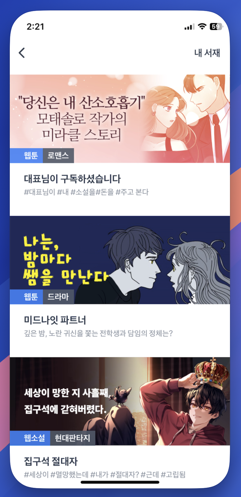

# \[ API ] 추천 컨텐츠 목록 조회\_RSS

## Version

버전 정보는 URL 경로에 표현하지 않으며, 헤더의 accept-version 속성 값에 정의합니다.

| Version | Date       | Description |
| ------- | ---------- | ----------- |
| 1.0.0   | 2026.06.11 | Create      |

## Rcommendation Contents

```
테스트
GET https://api-test.treasurecomics.com/external/recommendation/rss

라이브
GET https://api.treasurecomics.com/external/recommendation/rss
```

&#x20;**✓ 추천 컨텐츠 목록을 반환 합니다.**

### Security


**IPSec 또는 방화벽 구성을 위한 IP 정보가 필요한 경우 아래의 내용을 참고 하세요.**


<table><thead><tr><th width="344">Url</th><th>IPAddress</th></tr></thead><tbody><tr><td><strong>api-test.treasurecomics.com</strong></td><td>43.201.240.226</td></tr><tr><td></td><td>43.202.82.8</td></tr><tr><td><strong>api.treasurecomics.com</strong></td><td>15.165.122.39</td></tr><tr><td></td><td>3.38.54.136</td></tr></tbody></table>

### Headers

| Name           | Value         |
| -------------- | ------------- |
| Authorization  | `Basic token` |
| Accept-Version | `1.0.0`       |

### **Request Params**

별도의 요청 파라미터는 없습니다.

```
// get usage example
curl -H "Authorization: Basic {별도 전달받은 토큰}" \
     -H "Accept-Version: 1.0.0" \
     "https://api-test.treasurecomics.com/external/recommendation/rss"
```

### **Response**

RSS 2.0 XML. 커스텀 필드는 `tc` 네임스페이스(`xmlns:tc="https://treasurecomics.com/rss/recommendation"`)로 제공됩니다.

> RSS 본문 특성상 모든 값은 XML 텍스트 노드입니다. 아래 **타입**은 값의 논리적 타입을 의미합니다. **빈 값** 컬럼: `O` = 비어 있을 수 있음(`<tag></tag>`) · `X` = 항상 값 존재.

**Channel 필드**

<table><thead><tr><th width="235">Fields</th><th width="159">Type</th><th>Description</th></tr></thead><tbody><tr><td><code>title</code></td><td>string</td><td><code>{앱 이름} Recommendation</code></td></tr><tr><td><code>link</code></td><td>string (URL)</td><td>서비스 호스트 URL</td></tr><tr><td><code>description</code></td><td>string</td><td><code>TreasureComics recommendation feed</code> (고정)</td></tr><tr><td><code>lastBuildDate</code></td><td>string (RFC 1123)</td><td>피드 생성 시각 (UTC)</td></tr></tbody></table>

**Item 표준 필드**

<table><thead><tr><th width="238">Fields</th><th width="155">Type</th><th>Description</th></tr></thead><tbody><tr><td><code>title</code></td><td>string</td><td>콘텐츠 제목</td></tr><tr><td><code>link</code></td><td>string (URL)</td><td>랜딩 URL (게이트웨이 리다이렉트 URL)</td></tr><tr><td><code>description</code></td><td>string</td><td>콘텐츠 소개</td></tr><tr><td><code>guid</code></td><td>string</td><td>콘텐츠 단위 식별자 (<code>contentCName</code>). <code>isPermaLink="false"</code>. 동일 guid는 <strong>upsert(덮어쓰기)</strong> 처리.</td></tr><tr><td><code>pubDate</code></td><td>string (RFC 1123)</td><td>추천일(<code>recommendationDate</code>) 기준 (UTC)</td></tr></tbody></table>

**Item 커스텀 필드 (`tc:` 네임스페이스)**

<table><thead><tr><th width="239">Fields</th><th width="153">Type</th><th>Description</th></tr></thead><tbody><tr><td><code>tc:recommendationSN</code></td><td>integer</td><td>큐레이션(추천) 시퀀스 식별자. 동일 작품(<code>guid</code>)이 다른 큐레이션으로 다시 추천될 수 있습니다.</td></tr><tr><td><code>tc:contentType</code></td><td>string</td><td><code>웹툰</code> | <code>웹소설</code> | <code>숏드라마</code> </td></tr><tr><td><code>tc:thumbnail</code></td><td>string (URL)</td><td>썸네일 이미지 경로(세로형, webp 400×600)</td></tr><tr><td><code>tc:subThumbnail</code></td><td>string (URL)</td><td>썸네일 이미지 경로(가로형, webp)</td></tr><tr><td><code>tc:genre</code></td><td>string</td><td><p>장르</p><pre><code>로맨스 · 로맨스판타지 · 판타지 · 무협 · 드라마 · 액션 · 학원 · 일상 · 스포츠 · 공포/스릴러 · BL · GL · 현대판타지 · 대체역사 · 성인
</code></pre></td></tr><tr><td><code>tc:episodeNo</code></td><td>integer</td><td>회차 번호</td></tr><tr><td><code>tc:freeEpisode</code></td><td>integer</td><td>무료 회차 수 (없으면 <code>0</code>)</td></tr><tr><td><code>tc:contentMainUrl</code></td><td>string (URL)</td><td>작품 상세(메인) 페이지로 이동하는 게이트웨이 URL(참고용)</td></tr><tr><td><code>tc:returnUrl</code></td><td>string (URL)</td><td>게이트웨이 리다이렉트의 최종 목적지 URL(참고용)</td></tr></tbody></table>


**Response Code**




```xml
<?xml version="1.0" encoding="UTF-8"?>
<rss version="2.0" xmlns:tc="https://treasurecomics.com/rss/recommendation">
  <channel>
    <title>TreasureComics Recommendation</title>
    <link>https://treasurecomics.com</link>
    <description>TreasureComics recommendation feed</description>
    <lastBuildDate>Mon, 21 Apr 2025 00:00:00 GMT</lastBuildDate>
    <item>
      <title>아빠 하나, 아들 하나</title>
      <link>https://treasurecomics.com/gateway/common?returnUrl=https%3A%2F%2Ftreasurecomics.com%2Frecommendation%2Fwebtoon%2Fviewer%2Fcw72eeae0c62%2F1%3Freferrer%3Dtrecommendation%26rSN%3D3905</link>
      <description>6년 전 그날, 내게 온 두 개의 선물</description>
      <guid isPermaLink="false">cw72eeae0c62</guid>
      <pubDate>Mon, 21 Apr 2025 00:00:00 GMT</pubDate>
      <tc:recommendationSN>3905</tc:recommendationSN>
      <tc:contentType>웹툰</tc:contentType>
      <tc:thumbnail>https://s.treasurecomics.com/images/prod/webtoon/cw72eeae0c62/posterThumbnail_1741841610.jpg?f=webp&amp;w=400&amp;h=600</tc:thumbnail>
      <tc:subThumbnail>https://s.treasurecomics.com/images/prod/dailyRecommendationContent/955aae4743c64e939ee5a2eee0911dd3.jpg?f=webp</tc:subThumbnail>
      <tc:genre>로맨스</tc:genre>
      <tc:episodeNo>1</tc:episodeNo>
      <tc:freeEpisode>5</tc:freeEpisode>
      <tc:contentMainUrl>https://treasurecomics.com/gateway/common?returnUrl=https%3A%2F%2Fbitbunny.treasurecomics.com%2Fcontent%2Flist%2Fcw72eeae0c62</tc:contentMainUrl>
      <tc:returnUrl>https://treasurecomics.com/recommendation/webtoon/viewer/cw72eeae0c62/1?referrer=trecommendation&amp;rSN=3905</tc:returnUrl>
    </item>
    <item>
      <title>당씨고아</title>
      <link>https://treasurecomics.com/gateway/common?returnUrl=https%3A%2F%2Ftreasurecomics.com%2Frecommendation%2Fnovel%2Fviewer%2Fcn2b641081a4%2F1%3Freferrer%3Dtrecommendation%26rSN%3D3906</link>
      <description>복수를 가슴에 품고, 어떻게든 살아남기 위해 수단과 방법을 가리지 않는 당상원의 일대기.</description>
      <guid isPermaLink="false">cn2b641081a4</guid>
      <pubDate>Mon, 21 Apr 2025 00:00:00 GMT</pubDate>
      <tc:recommendationSN>3906</tc:recommendationSN>
      <tc:contentType>웹소설</tc:contentType>
      <tc:thumbnail>https://s.treasurecomics.com/images/prod/novel/cn2b641081a4/posterThumbnail_1740011920.jpg?f=webp&amp;w=400&amp;h=600</tc:thumbnail>
      <tc:subThumbnail>https://s.treasurecomics.com/images/prod/dailyRecommendationContent/07a864bb758e44ff9e256ce8cff00173.jpg?f=webp</tc:subThumbnail>
      <tc:genre>무협</tc:genre>
      <tc:episodeNo>1</tc:episodeNo>
      <tc:freeEpisode>25</tc:freeEpisode>
      <tc:contentMainUrl>https://treasurecomics.com/gateway/common?returnUrl=https%3A%2F%2Fbitbunny.treasurecomics.com%2Fcontent%2Flist%2Fcn2b641081a4</tc:contentMainUrl>
      <tc:returnUrl>https://treasurecomics.com/recommendation/novel/viewer/cn2b641081a4/1?referrer=trecommendation&amp;rSN=3906</tc:returnUrl>
    </item>
    <!-- ... -->
  </channel>
</rss>
```




***

## 이미지 캐싱


**앱 성능 향상**, **네트워크 절약**, **사용자 경험 개선을 위해 "thumbnail", "subThumbnail" 항목에 대해 이미지 캐싱 처리를 권장하고 있습니다.**

***

### <mark style="color:red;">보물섬은 이미지 변경시 이미지 URL이 변경됩니다. URL을 기준으로 캐싱 정책을 구성 하기기 바랍니다.</mark>


### ✅ 1. **빠른 이미지 로딩 (퍼포먼스 향상)**

이미지를 네트워크에서 매번 불러오면 로딩 시간이 길어지고 UI가 느려질 수 있습니다.\
→ 캐시에 저장해두면 디스크나 메모리에서 **즉시 로딩** 가능

***

### ✅ 2. **네트워크 트래픽 절약**

같은 이미지를 여러 번 다운로드하면 사용자 데이터 요금이 낭비되고, 서버 비용도 증가합니다.\
→ 캐싱은 **중복 다운로드 방지**에 효과적입니다.

***

### ✅ 3. **오프라인 지원**

인터넷이 없는 환경에서도 이미 본 이미지는 캐시에서 로드 가능\
→ 뉴스 앱, 쇼핑 앱, 갤러리 앱 등에 매우 유용

***

### ✅ 4. **배터리 사용 최적화**

불필요한 네트워크 요청은 CPU와 무선 칩을 많이 사용하게 되어 배터리 소모가 큽니다.\
→ 캐시는 **배터리 절약**에도 도움이 됩니다.

***

### ✅ 5. **UX(사용자 경험) 개선**

* 이미지가 **깜빡이지 않고** 부드럽게 뜹니다.
* 리스트 스크롤 시 **끊김 없이 로딩**됩니다.
* 사용자가 **앱이 빠르다고 느끼는** 중요한 포인트입니다.

### ✅ 6. 캐싱 처리 예시

* Android
  * [Glide](https://bumptech.github.io/glide/doc/caching.html)
  * [Coil](https://coil-kt.github.io/coil/image_loaders/#caching)
  * [Picasso](https://square.github.io/picasso/) (Automatic memory and disk caching.)
* iOS
  * [KingFisher](https://swiftpackageindex.com/onevcat/kingfisher/master/documentation/kingfisher/commontasks_cache)
  * [SDWebImages](https://github.com/SDWebImage/SDWebImageSwiftUI?tab=readme-ov-file#customization-and-configuration-setup)


## 추천 컨텐츠 목록 구현 화면 예시

<div align="left"><figure><figcaption></figcaption></figure></div>


