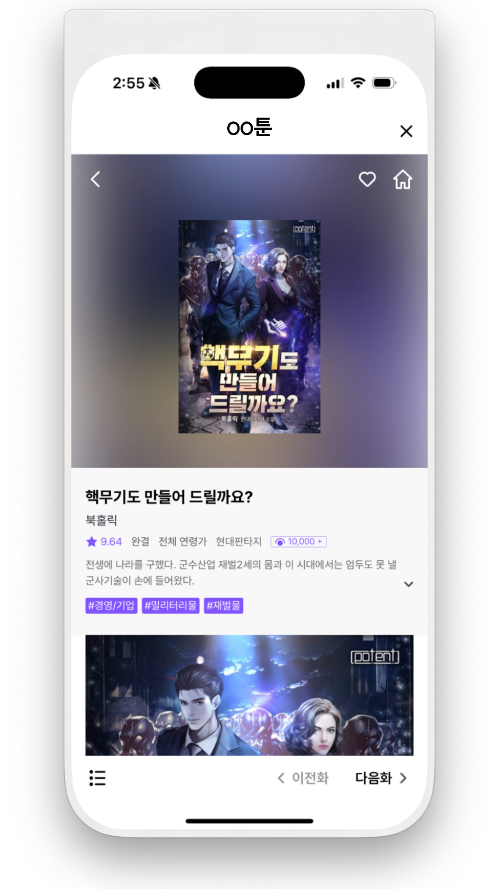

# 웹뷰 설정 가이드

유료 결제를 위한 Scheme 등록

TossPayments를 통한 유료 결제에 필요한 은행앱 패키지 등록

자세한 내용은 아래의 링크를 확인 하세요.



***

## 웹뷰 셋팅 ( Require ) <a href="#config" id="config"></a>

**✓ 웹뷰 셋팅 값 설정에 대한 방법을 안내합니다.**


WebView 구성에 필요한 **예제 코드**이며, 실 프로젝트에서는 **참고만 하시길 바랍니다**.

***

<mark style="color:red;">**✓ WebView(WKWebView) Javascript 및 DomStorage는 기본적으로 허용이 필수 입니다.**</mark>






<pre class="language-kotlin" data-line-numbers><code class="lang-kotlin">with(webView.settings) {
<strong>    // ---------- 필수 ---------- //
</strong><strong>    domStorageEnabled = true // DOM 스토리지 활성화
</strong><strong>    javaScriptEnabled = true // JavaScript 사용 가능
</strong><strong>    javaScriptCanOpenWindowsAutomatically = true // JavaScript에서 새 창 열기 허용
</strong><strong>    setSupportMultipleWindows(true) // 다중 창 지원
</strong><strong>    mediaPlaybackRequiresUserGesture = false // 사용자 제스처 없이 미디어 재생 허용
</strong>    // ---------- 옵션 ---------- //
    databaseEnabled = true // 데이터베이스 사용 가능
    cacheMode = WebSettings.LOAD_DEFAULT // 기본 캐시 모드 설정
    textZoom = 100 // 텍스트 확대/축소 비율 설정
    setSupportZoom(false) // 확대/축소 지원 비활성화
    displayZoomControls = false // 확대/축소 컨트롤 비활성화
    defaultTextEncodingName = "utf-8" // 기본 텍스트 인코딩 설정
    loadWithOverviewMode = true // 콘텐츠를 웹뷰에 맞게 축소하여 전체 내용을 한눈에 볼 수 있도록 설정 // 개요 모드로 로드 설정
    mixedContentMode = WebSettings.MIXED_CONTENT_ALWAYS_ALLOW // 혼합 컨텐츠 허용 (HTTPS 페이지에서 HTTP 컨텐츠 로드 가능)
    // WebSettings.MIXED_CONTENT_NEVER_ALLOW: 보안상의 이유로 HTTPS 페이지에서 HTTP 컨텐츠 로드를 차단
    // WebSettings.MIXED_CONTENT_ALWAYS_ALLOW: 모든 HTTP 및 HTTPS 컨텐츠 로드를 허용
    // WebSettings.MIXED_CONTENT_COMPATIBILITY_MODE: 기본적으로 HTTPS를 유지하지만 일부 HTTP 컨텐츠 로드를 허용 // 혼합 컨텐츠 허용
    if (Build.VERSION.SDK_INT &#x3C;= Build.VERSION_CODES.O) {
        // 콘텐츠를 단일 열로 정렬하여 화면 너비에 맞게 표시
        layoutAlgorithm = WebSettings.LayoutAlgorithm.SINGLE_COLUMN
    }
}
<strong>// 웹뷰의 오버스크롤을 제한합니다.
</strong><strong>WebView.overScrollMode = View.OVER_SCROLL_NEVER
</strong></code></pre>



<pre class="language-java" data-line-numbers><code class="lang-java">WebSettings webSettings = wView.getSettings();    
<strong>// ---------- 필수 ---------- //
</strong><strong>webSettings.setDomStorageEnabled(true); // DOM 스토리지 활성화
</strong><strong>webSettings.setJavaScriptEnabled(true); // JavaScript 사용 가능
</strong><strong>webSettings.setJavaScriptCanOpenWindowsAutomatically(true); // JavaScript에서 새 창 열기 허용
</strong><strong>webSettings.setSupportMultipleWindows(true); // 다중 창 지원
</strong><strong>webSettings.setMediaPlaybackRequiresUserGesture(false); // 사용자 제스처 없이 미디어 재생 허용
</strong>// ---------- 옵션 ---------- //
webSettings.setDatabaseEnabled(true); // 데이터베이스 사용 가능
webSettings.setCacheMode(WebSettings.LOAD_DEFAULT); // 기본 캐시 모드 설정
webSettings.setTextZoom(100); // 텍스트 확대/축소 비율 설정
webSettings.setSupportZoom(false); // 확대/축소 지원 비활성화
webSettings.setDisplayZoomControls(false); // 확대/축소 컨트롤 비활성화
webSettings.setDefaultTextEncodingName("utf-8"); // 기본 텍스트 인코딩 설정
webSettings.setLoadWithOverviewMode(true); // 콘텐츠를 웹뷰에 맞게 축소하여 전체 내용을 한눈에 볼 수 있도록 설정 // 개요 모드로 로드 설정
webSettings.setMixedContentMode(WebSettings.MIXED_CONTENT_ALWAYS_ALLOW); // 혼합 컨텐츠 허용 (HTTPS 페이지에서 HTTP 컨텐츠 로드 가능)
// WebSettings.MIXED_CONTENT_NEVER_ALLOW: 보안상의 이유로 HTTPS 페이지에서 HTTP 컨텐츠 로드를 차단
// WebSettings.MIXED_CONTENT_ALWAYS_ALLOW: 모든 HTTP 및 HTTPS 컨텐츠 로드를 허용
// WebSettings.MIXED_CONTENT_COMPATIBILITY_MODE: 기본적으로 HTTPS를 유지하지만 일부 HTTP 컨텐츠 로드를 허용 // 혼합 컨텐츠 허용
if (Build.VERSION.SDK_INT &#x3C;= Build.VERSION_CODES.O) {
    // 콘텐츠를 단일 열로 정렬하여 화면 너비에 맞게 표시
    webSettings.setLayoutAlgorithm(WebSettings.LayoutAlgorithm.SINGLE_COLUMN); // 레이아웃 알고리즘 설정 (오래된 버전 지원)
}

<strong>// 웹뷰의 오버스크롤을 제한합니다.
</strong><strong>WebView.setOverScrollMode(WebView.OVER_SCROLL_NEVER);
</strong></code></pre>






<mark style="color:red;">**WKWebView의 경우 모든 컨텐츠가 가려지지 않도록 SafeArea 내부에 위치 하도록 설정 바랍니다.**</mark>


<pre class="language-swift" data-line-numbers><code class="lang-swift">// ---------- 필수 ---------- //
// WKWebView의 설정을 관리하는 객체를 생성합니다. 이를 통해 JavaScript 실행, 쿠키 저장, 콘텐츠 접근 정책 등을 설정할 수 있습니다.
let configuration = WKWebViewConfiguration()
// JavaScript에서 window.open()을 사용하여 새로운 창을 자동으로 열 수 있도록 허용합니다.
configuration.preferences.javaScriptCanOpenWindowsAutomatically = true
// 기본적인 웹사이트 데이터 저장소를 설정합니다.
// 캐시, 쿠키, 세션 저장 등의 데이터를 관리하는 역할을 합니다.
configuration.websiteDataStore = WKWebsiteDataStore.default()
// Javascript 허용을 설정합니다.
// 버전에 따라 분기 처리하여 Javascript를 허용합니다.
if #available(iOS 14.0, *) {
    configuration.defaultWebpagePreferences.allowsContentJavaScript = true
} else {
    configuration.preferences.javaScriptEnabled = true
}
// WebView History Back&#x26;Forward
// 웹뷰의 스와이프 동작으로 앞으로가기 &#x26; 뒤로가기 동작을 설정합니다.
<strong>WKWebView.allowsBackForwardNavigationGestures = true
</strong>// 웹뷰의 오버스크롤을 제한합니다.
<strong>WKWebView.scrollView.bounces = false
</strong></code></pre>



***

## 웹뷰 네비게이션 바 ( Require ) <a href="#config" id="config"></a>

**✓ 웹뷰의 네비게이션 바는 우측에 닫기 버튼만 포함하도록 구성합니다.**

<figure><figcaption></figcaption></figure>

***

## 웹뷰 컨텐츠 보호 ( Require ) <a href="#secure" id="secure"></a>

**✓ 스크린 캡쳐 방지를 통해 콘텐츠를 보호하는 방법을 안내합니다.**



보물섬을 감싸고 있는 Activity에 FLAG\_SECURE 적용을 통해 쉽게 스크린 캡쳐 방지를 할 수 있습니다.



<pre class="language-kotlin"><code class="lang-kotlin">override fun onCreate(savedInstanceState: Bundle?) {
    super.onCreate(savedInstanceState)
<strong>    window.addFlags(WindowManager.LayoutParams.FLAG_SECURE)
</strong>    //..
    // code
    //..
}
</code></pre>



<pre class="language-java"><code class="lang-java">@Override
protected void onCreate(@Nullable Bundle savedInstanceState) {
    super.onCreate(savedInstanceState);
<strong>    getWindow().addFlags(WindowManager.LayoutParams.FLAG_SECURE);
</strong>    //..
    // code
    //..
}
</code></pre>





`UITextField`의 isSecureTextEntry 속성을 통해 사용자가 스크린 캡쳐를 할 수 없도록 우회 처리해야 합니다.


```swift
private let preventedView = UITextField()

func applySecureContent() {
    self.addSubview(self.preventedView)
    self.preventedView.backgroundColor = .clear
    self.preventedView.isSecureTextEntry = true
    self.preventedView.isUserInteractionEnabled = false
    self.preventedView.translatesAutoresizingMaskIntoConstraints = false
    self.preventedView.centerYAnchor.constraint(equalTo: self.centerYAnchor).isActive = true
    self.preventedView.centerXAnchor.constraint(equalTo: self.centerXAnchor).isActive = true
    self.preventedView.leftView = UIView(frame: CGRect(x: 0, y: 0, width: self.preventedView.frame.self.width, height: self.preventedView.frame.self.height))
    self.preventedView.leftViewMode = .always
    self.layer.superlayer?.addSublayer(self.preventedView.layer)
    self.preventedView.layer.sublayers?.last?.addSublayer(self.layer)
}

//..
//..
override func viewDidAppear(_ animated: Bool) {
    DispatchQueue.main.async {
        applySecureContent()
    }
}
```




***

## Javascript Window 처리 ( Require ) <a href="#scheme" id="scheme"></a>


웹뷰 구성에 필요한 **Scheme** 처리에 대한 **예제 코드**이며, 실 프로젝트에서는 **참고만 하시길 바랍니다**.




### Javascript window.open

WebView에서 `window.open()`을 처리하려면 **WebChromeClient**를 설정하고, `onCreateWindow()`를 오버라이드해야 합니다.




```kotlin
webView.webChromeClient = object : WebChromeClient() {
    override fun onCreateWindow(
        view: WebView?,
        isDialog: Boolean,
        isUserGesture: Boolean,
        resultMsg: Message?
    ): Boolean {
        val newWebView = WebView(view?.context!!)
        newWebView.webViewClient = WebViewClient()
        newWebView.webChromeClient = WebChromeClient()

        // 새 창을 다룰 수 있도록 WebView를 포함하는 Dialog 생성
        val dialog = Dialog(view.context)
        dialog.setContentView(newWebView)
        dialog.show()

        val transport = resultMsg?.obj as? WebView.WebViewTransport
        transport?.webView = newWebView
        resultMsg?.sendToTarget()

        return true
    }
}
```







```java
webView.setWebChromeClient(new WebChromeClient() {
    @Override
    public boolean onCreateWindow(WebView view, boolean isDialog, boolean isUserGesture, Message resultMsg) {
        WebView newWebView = new WebView(view.getContext());
        newWebView.setWebViewClient(new WebViewClient());
        newWebView.setWebChromeClient(new WebChromeClient());

        // 새 창을 다룰 수 있도록 WebView를 포함하는 Dialog 등을 생성
        Dialog dialog = new Dialog(view.getContext());
        dialog.setContentView(newWebView);
        dialog.show();

        WebView.WebViewTransport transport = (WebView.WebViewTransport) resultMsg.obj;
        transport.setWebView(newWebView);
        resultMsg.sendToTarget();

        return true;
    }
});
```




***

### Javascript Alert

`Android WebView`에서 `window.alert()`을 처리하려면 `WebChromeClient`의 `onJsAlert()` 메서드를 오버라이드해야 합니다. 이 메서드는 JavaScript의 `alert()` 창이 호출될 때 반응할 수 있게 해줍니다.




```kotlin
webView.webChromeClient = object : WebChromeClient() {
    override fun onJsAlert(view: WebView?, url: String?, message: String?, result: JsResult?): Boolean {
        // Create a custom AlertDialog to handle the JavaScript alert
        val builder = AlertDialog.Builder(view?.context)
        builder.setMessage(message) // The message from JavaScript alert
            .setCancelable(false)
            .setPositiveButton("OK") { _, _ ->
                result?.confirm() // Confirm the alert
            }
        val alert = builder.create()
        alert.show()
        return true // Indicate that the alert has been handled
    }
}
```







```java
webView.setWebChromeClient(new WebChromeClient() {
    @Override
    public boolean onJsAlert(WebView view, String url, String message, JsResult result) {
        // Create a custom AlertDialog to handle the JavaScript alert
        AlertDialog.Builder builder = new AlertDialog.Builder(view.getContext());
        builder.setMessage(message) // The message from JavaScript alert
            .setCancelable(false)
            .setPositiveButton("OK", new DialogInterface.OnClickListener() {
                @Override
                public void onClick(DialogInterface dialog, int which) {
                    result.confirm(); // Confirm the alert
                }
            });

        AlertDialog alert = builder.create();
        alert.show();

        return true; // Indicate that the alert has been handled
    }
});
```




***

### Javascript Confirm

`Android WebView`에서 `window.confirm()`을 처리하려면 `WebChromeClient`의 `onJsConfirm()` 메서드를 오버라이드해야 합니다. 이 메서드는 JavaScript의 `confirm()` 창이 호출될 때 반응할 수 있게 해줍니다.




```kotlin
webView.webChromeClient = object : WebChromeClient() {
    override fun onJsConfirm(
        view: WebView?,
        url: String?,
        message: String?,
        result: JsResult?
    ): Boolean {
        // 확인 대화상자를 직접 처리
        val builder = AlertDialog.Builder(view?.context)
        builder.setMessage(message)
            .setCancelable(false)
            .setPositiveButton("OK") { _, _ -> 
                result?.confirm() // 확인 버튼 클릭 시 확인 응답
            }
            .setNegativeButton("Cancel") { _, _ -> 
                result?.cancel() // 취소 버튼 클릭 시 취소 응답
            }
        val alert = builder.create()
        alert.show()

        return true // 대화상자를 직접 처리했음을 알림
    }
}

```







```java
webView.setWebChromeClient(new WebChromeClient() {
    @Override
    public boolean onJsConfirm(WebView view, String url, String message, JsResult result) {
        // Handle the confirmation dialog directly
        AlertDialog.Builder builder = new AlertDialog.Builder(view.getContext());
        builder.setMessage(message)
            .setCancelable(false)
            .setPositiveButton("OK", new DialogInterface.OnClickListener() {
                @Override
                public void onClick(DialogInterface dialog, int which) {
                    result.confirm(); // Confirm response when "OK" is clicked
                }
            })
            .setNegativeButton("Cancel", new DialogInterface.OnClickListener() {
                @Override
                public void onClick(DialogInterface dialog, int which) {
                    result.cancel(); // Cancel response when "Cancel" is clicked
                }
            });

        AlertDialog alert = builder.create();
        alert.show();

        return true; // Indicate that the dialog was handled
    }
});
```




***

### Javascript Alert(Confirm) TextInput

JavaScript의 `window.prompt()`를 WebView에서 처리하려면, `WebChromeClient`의 `onJsPrompt()` 메서드를 오버라이드하여 사용자 입력을 받을 수 있는 맞춤형 다이얼로그를 생성할 수 있습니다.




```kotlin
webView.webChromeClient = object : WebChromeClient() {
    override fun onJsPrompt(view: WebView?, url: String?, message: String?, defaultValue: String?, result: JsPromptResult?): Boolean {
        // JavaScript prompt를 대체할 커스텀 입력 다이얼로그 생성
        val builder = AlertDialog.Builder(view?.context)
        builder.setTitle("Prompt")
            .setMessage(message) // JavaScript prompt에서 전달된 메시지
            .setCancelable(false)

        // 입력 필드를 생성
        val input = EditText(view?.context)
        input.setText(defaultValue) // 기본값이 있다면 기본값을 미리 설정
        builder.setView(input)

        builder.setPositiveButton("OK") { _, _ ->
            val userInput = input.text.toString()
            result?.confirm(userInput) // 사용자가 입력한 값으로 JavaScript에 응답
        }

        builder.setNegativeButton("Cancel") { _, _ ->
            result?.cancel() // "Cancel" 클릭 시 null을 JavaScript로 반환
        }

        val alert = builder.create()
        alert.show()

        return true // prompt가 처리되었음을 WebView에 알림
    }
}

```







```java
webView.setWebChromeClient(new WebChromeClient() {
    @Override
    public boolean onJsPrompt(WebView view, String url, String message, String defaultValue, JsPromptResult result) {
        // JavaScript prompt를 대체할 커스텀 입력 다이얼로그 생성
        AlertDialog.Builder builder = new AlertDialog.Builder(view.getContext());
        builder.setTitle("Prompt")
            .setMessage(message) // JavaScript prompt에서 전달된 메시지
            .setCancelable(false);

        // 입력 필드를 생성
        final EditText input = new EditText(view.getContext());
        input.setText(defaultValue); // 기본값이 있다면 기본값을 미리 설정
        builder.setView(input);

        builder.setPositiveButton("OK", new DialogInterface.OnClickListener() {
            @Override
            public void onClick(DialogInterface dialog, int which) {
                String userInput = input.getText().toString();
                result.confirm(userInput); // 사용자가 입력한 값으로 JavaScript에 응답
            }
        });

        builder.setNegativeButton("Cancel", new DialogInterface.OnClickListener() {
            @Override
            public void onClick(DialogInterface dialog, int which) {
                result.cancel(); // "Cancel" 클릭 시 null을 JavaScript로 반환
            }
        });

        AlertDialog alert = builder.create();
        alert.show();

        return true; // prompt가 처리되었음을 WebView에 알림
    }
});

```








### Javascript window.open

WKWebView javascript window.open() 명령어 처리 방법에 대한 안내


**public protocol UIWebViewDelegate**

***

`func webView(_ webView: WKWebView, createWebViewWith configuration: WKWebViewConfiguration, for navigationAction: WKNavigationAction, windowFeatures: WKWindowFeatures) -> WKWebView?`

***

:white\_check\_mark: **여러개의 팝업이 열린 경우를 위해 해당 웹뷰에 대한 리소스 관리가 필요합니다.**

* 웹 뷰의 크기와 위치는 원하는 값을 넣어 사용합니다.
* 모달 윈도우의 옵션은 앱의 상황에 따라 변경 후 사용하세요.



```swift
// MARK: - Javascript window.open { WKUIDelegate }
func webView(_ webView: WKWebView, createWebViewWith configuration: WKWebViewConfiguration, for navigationAction: WKNavigationAction, windowFeatures: WKWindowFeatures) -> WKWebView? {    
    let viewControllerToPresent = UIViewController()
    viewControllerToPresent.view.backgroundColor = UIColor.white
    viewControllerToPresent.modalPresentationStyle = .automatic
    if let sheet = viewControllerToPresent.sheetPresentationController {
        sheet.prefersGrabberVisible = true
    }
    // 웹뷰를 생성하여 리턴하면 현재 웹뷰와 parent 관계가 형성됩니다.
    let modalView = WKWebView(frame: CGRect(x: 0, y: 12, width: self.bounds.width, height: self.bounds.height), configuration: configuration)
    // set delegate
    modalView.uiDelegate = self
    modalView.navigationDelegate = self
    // setup scrollview
    modalView.scrollView.bounces = false
    modalView.scrollView.isPagingEnabled = false
    modalView.scrollView.alwaysBounceVertical = false
    modalView.scrollView.showsVerticalScrollIndicator = false
    modalView.scrollView.showsHorizontalScrollIndicator = false
    modalView.scrollView.contentInsetAdjustmentBehavior = .never
    // addview
    viewControllerToPresent.view.addSubview(modalView)
    viewControllerToPresent.presentationController?.delegate = self
    // present
    self.viewController.present(viewControllerToPresent, animated: true);
    return modalView
}
```


***

### javascript window.close

WKWebView javascript window.close() 명령어 처리 방법에 대한 안내


**public protocol UIWebViewDelegate**

***

`func webViewDidClose(_ webView: WKWebView)`



```swift
// MARK: - window.close { UIWebViewDelegate }
func webViewDidClose(_ webView: WKWebView) {
    webView.removeFromSuperView()
    //webView = nil
}
```


***

### Javascript Alert

Javascript alert 팝업 윈도우 처리에 대한 가이드


**public protocol UIWebViewDelegate**

***

`func webView(_ webView: WKWebView, runJavaScriptAlertPanelWithMessage message: String, initiatedByFrame frame: WKFrameInfo, completionHandler: @escaping @MainActor () -> Void)`



```swift
// MARK: - Javascript Alert Controll { UIWebViewDelegate }
func webView(_ webView: WKWebView, runJavaScriptAlertPanelWithMessage message: String, initiatedByFrame frame: WKFrameInfo, completionHandler: @escaping @MainActor () -> Void) {
    let alertController = UIAlertController(title: nil, message: message, preferredStyle: .actionSheet)
    alertController.addAction(UIAlertAction(title: "확인", style: .default, handler: { (action) in
        completionHandler()
    }))
    DispatchQueue.main.async{
        self.viewController?.present(alertController, animated: true, completion: nil)
    }
}
```


***

### Javascript Confirm

javascript confirm 팝업 윈도우 처리에 대한 가이드


**public protocol UIWebViewDelegate**

***

`func webView(_ webView: WKWebView, runJavaScriptConfirmPanelWithMessage message: String, initiatedByFrame frame: WKFrameInfo, completionHandler: @escaping @MainActor (Bool) -> Void)`



```swift
// MARK: - Javascript Confirm Controll { UIWebViewDelegate }
func webView(_ webView: WKWebView, runJavaScriptConfirmPanelWithMessage message: String, initiatedByFrame frame: WKFrameInfo, completionHandler: @escaping @MainActor (Bool) -> Void) {
    let alertController = UIAlertController(title: nil, message: message, preferredStyle: .actionSheet)
    alertController.addAction(UIAlertAction(title: "확인", style: .default, handler: { (action) in
        completionHandler(true)
    }))
    alertController.addAction(UIAlertAction(title: "취소", style: .default, handler: { (action) in
        completionHandler(false)
    }))
    self.viewController?.present(alertController, animated: true, completion: nil)
}
```


***

### Javascript Alert(Confirm) TextInput

javascript 텍스트 입력이 필요한 팝업 윈도우 처리에 대한 가이드


**public protocol UIWebViewDelegate**

***

`func webView(_ webView: WKWebView, runJavaScriptTextInputPanelWithPrompt prompt: String, defaultText: String?, initiatedByFrame frame: WKFrameInfo, completionHandler: @escaping @MainActor (String?) -> Void)`



```swift
// MARK: - Javascript InputText Controll { UIWebViewDelegate }
func webView(_ webView: WKWebView, runJavaScriptTextInputPanelWithPrompt prompt: String, defaultText: String?, initiatedByFrame frame: WKFrameInfo, completionHandler: @escaping @MainActor (String?) -> Void) {
    let alertController = UIAlertController(title: nil, message: prompt, preferredStyle: .actionSheet)
    alertController.addTextField { (textField) in
        textField.text = defaultText
    }
    alertController.addAction(UIAlertAction(title: "확인", style: .default, handler: { (action) in
        if let text = alertController.textFields?.first?.text {
            completionHandler(text)
        } else {
            completionHandler(defaultText)
        }
    }))
    alertController.addAction(UIAlertAction(title: "취소", style: .default, handler: { (action) in
        completionHandler(nil)
    }))
    self.viewController?.present(alertController, animated: true, completion: nil)

```




***

## Scheme 처리 ( Require ) <a href="#scheme" id="scheme"></a>


웹뷰 구성에 필요한 **Scheme** 처리에 대한 **예제 코드**이며, 실 프로젝트에서는 **참고만 하시길 바랍니다**.




✓ WebView::shouldOverrideUrlLoading을 통해 전달된 scheme 처리에 대한 방법을 가이드합니다.

### intent


```kotlin
private fun actionIntentTask(viewContext: Context, webView: WebView?, url: String): Boolean {
    val actionWebView = webView ?: return false
    val actionActivity = viewContext as? Activity ?: return false
    val actionIntent = try {
        Intent.parseUri(url, Intent.URI_INTENT_SCHEME)
    } catch (e: Exception) {
        // error
        null        
    }

    // check intent
    if (actionIntent == null) {
        Log.e("TAG", "intent is null")
        return false
    }

    try {
        // Fallback URL -> Loading WebView For Kakao
        val fallbackUrl = actionIntent.getStringExtra("browser_fallback_url")
        if (fallbackUrl != null) {
            actionWebView.loadUrl(fallbackUrl)
            return true
        }
        
        // action
        val actionPackageName = actionIntent.`package` ?: ""
        if (actionPackageName.isNotEmpty()) {
            // launch activity
            val launchIntent = viewContext.packageManager.getLaunchIntentForPackage(actionPackageName)
            if (launchIntent != null) {
                actionActivity.startActivity(launchIntent)
                return true
            }
        }
        
        // market
        if (actionPackageName.isNotEmpty()) {
            try {
                val marketIntent = Intent(Intent.ACTION_VIEW)
                marketIntent.data = Uri.parse("market://details?id=$actionPackageName")
                actionActivity.startActivity(marketIntent)
                return true
            } catch (e: Exception) {
                // error
            }
        }
    } catch (e: Exception) {
            // error
        }
    }
    return false
}
```


***

### Market

schem market 처리 방식을 안내합니다.


```kotlin
private fun actionMarketTask(viewContext: Context, url: String): Boolean {
    val activity = viewContext as? Activity ?: return false
    kotlin.runCatching {
        val id = Uri.parse(url).getQueryParameter("id")
        val marketIntent = Intent(Intent.ACTION_VIEW).apply {
            data = Uri.parse("market://details?id=$id")
        }
        if (marketIntent.resolveActivity(viewContext.packageManager) != null) {
            activity.startActivity(marketIntent)
        } else {
            val viewIntent = Intent(Intent.ACTION_VIEW).apply {
                data = Uri.parse("https://play.google.com/store/apps/details?id=$id")
            }
            activity.startActivity(viewIntent)
        }
    }.onFailure {
        // error
    }
    return true
}
```


***

### Mailto


```kotlin
private fun actionMailToTask(viewContext: Context, uri: Uri): Boolean {
    val activity = viewContext as? Activity ?: return false
    kotlin.runCatching {
        activity.startActivity(Intent(Intent.ACTION_VIEW, uri))
    }.onFailure {
        tales.error(moduleName = moduleName, throwable = it, trace = { "actionMailToTask { uri: $uri }" })
        it.message?.produce { message -> ToastView.show(context = viewContext, message = message) }
    }
    return true
}
```






### Javascript window.open

WKWebView javascript window.open() 명령어 처리 방법에 대한 안내


**public protocol UIWebViewDelegate**

***

`func webView(_ webView: WKWebView, createWebViewWith configuration: WKWebViewConfiguration, for navigationAction: WKNavigationAction, windowFeatures: WKWindowFeatures) -> WKWebView?`

***

:white\_check\_mark: **여러개의 팝업이 열린 경우를 위해 해당 웹뷰에 대한 리소스 관리가 필요합니다.**

* 웹 뷰의 크기와 위치는 원하는 값을 넣어 사용합니다.
* 모달 윈도우의 옵션은 앱의 상황에 따라 변경 후 사용하세요.



```swift
// MARK: - Javascript window.open { WKUIDelegate }
func webView(_ webView: WKWebView, createWebViewWith configuration: WKWebViewConfiguration, for navigationAction: WKNavigationAction, windowFeatures: WKWindowFeatures) -> WKWebView? {    
    let viewControllerToPresent = UIViewController()
    viewControllerToPresent.view.backgroundColor = UIColor.white
    viewControllerToPresent.modalPresentationStyle = .automatic
    if let sheet = viewControllerToPresent.sheetPresentationController {
        sheet.prefersGrabberVisible = true
    }
    // 웹뷰를 생성하여 리턴하면 현재 웹뷰와 parent 관계가 형성됩니다.
    let modalView = WKWebView(frame: CGRect(x: 0, y: 12, width: self.bounds.width, height: self.bounds.height), configuration: configuration)
    // set delegate
    modalView.uiDelegate = self
    modalView.navigationDelegate = self
    // setup scrollview
    modalView.scrollView.bounces = false
    modalView.scrollView.isPagingEnabled = false
    modalView.scrollView.alwaysBounceVertical = false
    modalView.scrollView.showsVerticalScrollIndicator = false
    modalView.scrollView.showsHorizontalScrollIndicator = false
    modalView.scrollView.contentInsetAdjustmentBehavior = .never
    // addview
    viewControllerToPresent.view.addSubview(modalView)
    viewControllerToPresent.presentationController?.delegate = self
    // present
    self.viewController.present(viewControllerToPresent, animated: true);
    return modalView
}
```


***

### javascript window.close

WKWebView javascript window.close() 명령어 처리 방법에 대한 안내


**public protocol UIWebViewDelegate**

***

`func webViewDidClose(_ webView: WKWebView)`



```swift
// MARK: - window.close { UIWebViewDelegate }
func webViewDidClose(_ webView: WKWebView) {
    webView.removeFromSuperView()
    //webView = nil
}
```


***

### Javascript Alert

Javascript alert 팝업 윈도우 처리에 대한 가이드


**public protocol UIWebViewDelegate**

***

`func webView(_ webView: WKWebView, runJavaScriptAlertPanelWithMessage message: String, initiatedByFrame frame: WKFrameInfo, completionHandler: @escaping @MainActor () -> Void)`



```swift
// MARK: - Javascript Alert Controll { UIWebViewDelegate }
func webView(_ webView: WKWebView, runJavaScriptAlertPanelWithMessage message: String, initiatedByFrame frame: WKFrameInfo, completionHandler: @escaping @MainActor () -> Void) {
    let alertController = UIAlertController(title: nil, message: message, preferredStyle: .actionSheet)
    alertController.addAction(UIAlertAction(title: "확인", style: .default, handler: { (action) in
        completionHandler()
    }))
    DispatchQueue.main.async{
        self.viewController?.present(alertController, animated: true, completion: nil)
    }
}
```


***

### Javascript Confirm

javascript confirm 팝업 윈도우 처리에 대한 가이드


**public protocol UIWebViewDelegate**

***

`func webView(_ webView: WKWebView, runJavaScriptConfirmPanelWithMessage message: String, initiatedByFrame frame: WKFrameInfo, completionHandler: @escaping @MainActor (Bool) -> Void)`



```swift
// MARK: - Javascript Confirm Controll { UIWebViewDelegate }
func webView(_ webView: WKWebView, runJavaScriptConfirmPanelWithMessage message: String, initiatedByFrame frame: WKFrameInfo, completionHandler: @escaping @MainActor (Bool) -> Void) {
    let alertController = UIAlertController(title: nil, message: message, preferredStyle: .actionSheet)
    alertController.addAction(UIAlertAction(title: "확인", style: .default, handler: { (action) in
        completionHandler(true)
    }))
    alertController.addAction(UIAlertAction(title: "취소", style: .default, handler: { (action) in
        completionHandler(false)
    }))
    self.viewController?.present(alertController, animated: true, completion: nil)
}
```


***

### Javascript Alert(Confirm) TextInput

javascript 텍스트 입력이 필요한 팝업 윈도우 처리에 대한 가이드


**public protocol UIWebViewDelegate**

***

`func webView(_ webView: WKWebView, runJavaScriptTextInputPanelWithPrompt prompt: String, defaultText: String?, initiatedByFrame frame: WKFrameInfo, completionHandler: @escaping @MainActor (String?) -> Void)`



```swift
// MARK: - Javascript InputText Controll { UIWebViewDelegate }
func webView(_ webView: WKWebView, runJavaScriptTextInputPanelWithPrompt prompt: String, defaultText: String?, initiatedByFrame frame: WKFrameInfo, completionHandler: @escaping @MainActor (String?) -> Void) {
    let alertController = UIAlertController(title: nil, message: prompt, preferredStyle: .actionSheet)
    alertController.addTextField { (textField) in
        textField.text = defaultText
    }
    alertController.addAction(UIAlertAction(title: "확인", style: .default, handler: { (action) in
        if let text = alertController.textFields?.first?.text {
            completionHandler(text)
        } else {
            completionHandler(defaultText)
        }
    }))
    alertController.addAction(UIAlertAction(title: "취소", style: .default, handler: { (action) in
        completionHandler(nil)
    }))
    self.viewController?.present(alertController, animated: true, completion: nil)
}
```


***

### Mailto

mailto scheme 처리에 방법에 대한 안내

**✓ update** → **subject, messageBody**


**public protocol UIWebViewDelegate, MFMailComposeViewControllerDelegate**\
**WebView를 포함한 ViewController에 "MFMailComposeViewControllerDelegate" 선언이 필요합니다.**

***

`func webView(_ webView: WKWebView, decidePolicyFor navigationAction: WKNavigationAction, decisionHandler: @escaping @MainActor (WKNavigationActionPolicy) -> Void)`


<pre class="language-swift" data-line-numbers><code class="lang-swift"><strong>import MessageUI
</strong><strong>// MFMailComposeViewControllerDelegate 선언이 필요합니다.
</strong>
// MARK: - mailto: { UIWebViewDelegate }
func webView(_ webView: WKWebView, decidePolicyFor navigationAction: WKNavigationAction, decisionHandler: @escaping @MainActor (WKNavigationActionPolicy) -> Void) {
    // check url
    guard let url = navigationAction.request.url else {
        self.error(stackMessage: "scheme -> url is null")
        decisionHandler(.allow)
        return
    }
    // check sheme
    guard let scheme = url.scheme else {
        decisionHandler(.allow)
        return
    }
    // mailto
    if scheme == "mailto" {
<strong>        hadleMailtoLink(url: url)
</strong><strong>        decisionHandler(.cancel)
</strong>        return
    }
}

<strong>private func hadleMailtoLink(url: URL) {
</strong>    if MFMailComposeViewController.canSendMail() {
        let mailVC = MFMailComposeViewController()
        mailVC.mailComposeDelegate = self
        // 1. mailto:주소?subject=...&#x26;body=... 에서 주소와 쿼리 분리
        if let components = URLComponents(url: url, resolvingAgainstBaseURL: false) {
            // 받는 사람 설정
            if let toAddress = components.path.removingPercentEncoding {
                mailVC.setToRecipients([toAddress])
            }
            // 쿼리 파라미터 처리
            if let queryItems = components.queryItems {
                for item in queryItems {
                    switch item.name.lowercased() {
                    case "subject":
                        mailVC.setSubject(item.value ?? "")
                    case "body":
                        mailVC.setMessageBody(item.value ?? "", isHTML: false)
                    default:
                        break
                    }
                }
            }
        }
        viewController?.present(mailVC, animated: true)
    } else {
        // 메일을 보낼 수 없는 경우: 사용자에게 안내
        let alert = UIAlertController(
            title: "메일 설정 오류",
            message: "메일 앱이 설정되어 있지 않거나 메일을 보낼 수 없습니다. 메일 계정을 설정해주세요.",
            preferredStyle: .alert
        )
        alert.addAction(UIAlertAction(title: "확인", style: .default, handler: nil))
        viewController?.present(alert, animated: true, completion: nil)
    }
}
</code></pre>

***

### Tel

tel scheme 처리에 방법에 대한 안내


**public protocol UIWebViewDelegate**

***

`func webView(_ webView: WKWebView, decidePolicyFor navigationAction: WKNavigationAction, decisionHandler: @escaping @MainActor (WKNavigationActionPolicy) -> Void)`


<pre class="language-swift" data-line-numbers><code class="lang-swift">// MARK: - tel: { UIWebViewDelegate }
func webView(_ webView: WKWebView, decidePolicyFor navigationAction: WKNavigationAction, decisionHandler: @escaping @MainActor (WKNavigationActionPolicy) -> Void) {
    // check url
    guard let url = navigationAction.request.url else {
        self.error(stackMessage: "scheme -> url is null")
        decisionHandler(.allow)
        return
    }
    // check sheme
    guard let scheme = url.scheme else {
        decisionHandler(.allow)
        return
    }
    // tel
    if scheme == "tel" {
<strong>        handleTelLink(url: url)
</strong><strong>        decisionHandler(.cancel)
</strong>        return
    }
}

<strong>private func handleTelLink(url: URL) {
</strong>    UIApplication.shared.open(url, options: [:], completionHandler: nil)
}

</code></pre>




