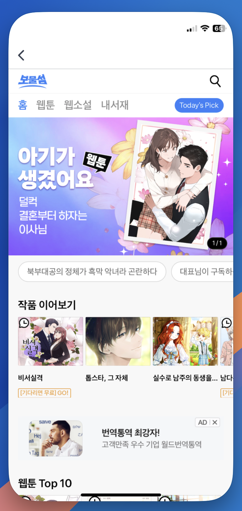

# 채널회원 연동


메인화면 진입 하기

***

<mark style="color:red;">**✓**</mark>  <mark style="color:red;">**기존 화면이 아닌 새로운 창을 통해 보물섬을 실행하세요 !**</mark>

✓ 메인 화면 진입 경로에 <mark style="color:red;">**sign parameter**</mark>를 전달하여 보물섬 메인화면에 진입합니다.


## 메인화면 진인 경로

```
https://{env}.treasurecomics.com/gateway/common?sign={sign-value}&returnUrl=https://{env}.treasurecomics.com/main
```

**✓** **returnUrl 은 UrlEncode된 값으로 전달 합니다.**

**✓** `{env}` 값은 **영업팀을 통해 별도 전달** 됩니다.

### **signature 생성 하기**


**signature 생성 (**<mark style="color:red;">**HmacSHA256 생성에 필요한 Key는 영업팀을 통해 전달 됩니다.**</mark>**)**

***

<mark style="color:red;">**{} 표현은 변수 입니다 ({}값이 포함되지 않도록 주의 바랍니다.)**</mark>

**{timeStamp}{nonce}{암호화된User식별자}**

위 값을 HmacSHA256 Hash → Base64 Url Encodeing을 통해 Signature를 생성합니다.

***

* timeStamp → unix timestamp seconds
* nonce → 문자열 32자(임의로 생성된 문자열 32자)
* user 식별자 → 회원 구분이 가능한 식별자



<table data-full-width="false"><thead><tr><th width="127">Name</th><th width="141">Type</th><th>Description</th></tr></thead><tbody><tr><td><code>sign</code></td><td>string</td><td><p><code>timestmap.nonce.encryptedUserId.signature</code></p><hr><p> <mark style="background-color:red;">timestamp, nonce, userid  값은 <strong>signature 생성에 사용된 값</strong>을 전달 합니다.</mark></p></td></tr></tbody></table>

### 사용 예

```
https://test.treasurecomics.com/gateway/common?sign=1724922215.7b82817d9487471a8a782c2604883924.lymanTest.M21MZORoc4NbVzq1ZaSC8LgcOKYH9SBIljHYjVOfX5o%3D&returnUrl=https%3A%2F%2Ftest.treasurecomics.com%2Fmain
```

***

<figure><figcaption><p>안내 메시지 노출 예시 화면</p></figcaption></figure>

***

## 메인화면

<div align="left"><figure><figcaption></figcaption></figure></div>


